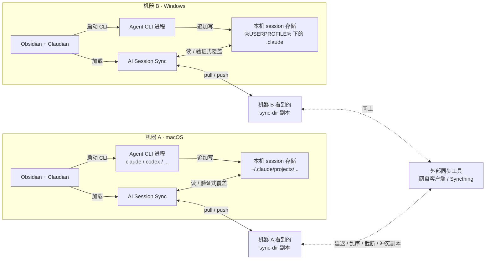
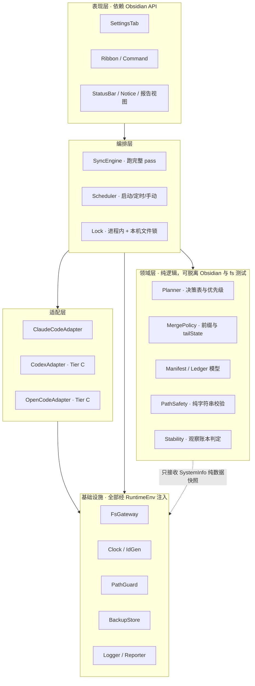
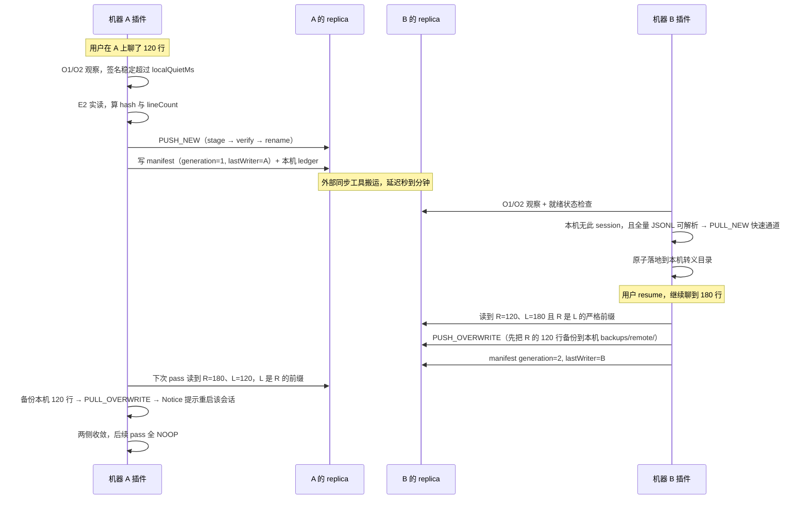
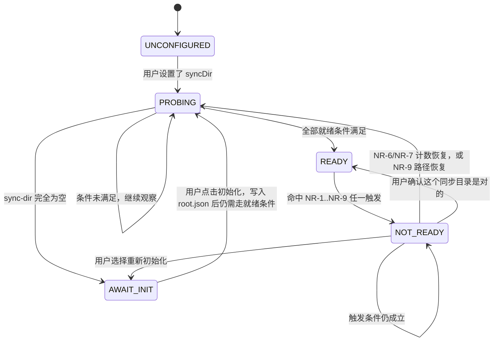

# AI Session Sync — 架构设计

> **文档状态**：设计稿（pre-implementation）。仓库尚无代码，本文描述的是**目标架构**，用于指导 M1 实现。
> **规范地位**：本文是本项目的**当前实现规范**（normative）。`CLAUDE.md` 只承载产品目标、边界与协作约定，**不复述技术决策**（它会被 agent 自动注入、优先级最高，两处并存必然漂移）；启动期草稿里已被本文取代的条款，逐条记在[附录 A](#附录-a--claudemd-已废弃条款)。
> **最后更新**：2026-08-06（第 2 版，已吸收 [review/1_architecture-and-testing-review.md](../../review/1_architecture-and-testing-review.md) 的审核意见）
> **配套文档**：[testing.md](./testing.md)（测试策略与验收方法）
>
> 文中标注 ✅ 的事实已实测确认：开发机（Linux / Claude Code 2.1.222–2.1.223 / Codex 0.146.0-alpha.9.2）+ **2026-08-06 的 macOS / Windows 真机探测**（macOS 26.5 arm64、Windows 11 26200；Claude Code 2.1.211–2.1.223、Codex 0.146.0）。原始报告与逐条判定见 [findings/2026-08-06-spike-conclusions.md](./findings/2026-08-06-spike-conclusions.md)。标注 ⚠️ 的仍是推测或待验证。
> **⚠️ 的效力是硬性的**：任何仍标 ⚠️ 的假设都不得作为**破坏性写入**的依据，依赖它的代码路径必须保持只读或 dry-run，直到对应 Spike 回填 ✅。

---

## 1. 系统目标与定位

在多台电脑之间同步 AI agent CLI 的**原始 session 文件**，使用户能在另一台机器上 `resume` 同一段对话继续工作。

一句话描述：**一个把 agent CLI 的 session 存储在多机之间做"带语义的搬运工"的 Obsidian desktop 插件**。它不理解对话内容，只理解 session 文件的**追加式结构**和**机器相关的落位规则**。

### 1.1 为什么是 Obsidian 插件而不是独立 CLI/守护进程

| 理由 | 说明 |
|---|---|
| 触发时机天然对齐 | 用户在 Obsidian 里通过 Claudian 使用 agent CLI，Obsidian 启动/关闭即 session 生命周期边界 |
| 免部署 | 用户已有 Obsidian，不需要额外装 daemon、配 launchd/计划任务 |
| 配置与 vault 绑定 | workspace 身份可以存在 vault 内，随 vault 自身同步（§5.2） |
| UI 现成 | 设置面板、Notice、状态栏、command palette 都不用自己造 |

代价：只在 Obsidian 运行时同步（非常驻）。可接受——session 只在用户用 CLI 时变化，而用 CLI 时 Obsidian 通常开着。

---

## 2. 系统边界

### 2.1 在范围内

- 扫描本机各 provider 的 session 存储，识别属于当前 workspace 的 session
- 在**本机目录 ↔ 中立同步目录**之间双向搬运
- append-only jsonl 的**前缀安全合并**（更长且完整包含对方的一方才能覆盖）
- 发散（divergent）内容的检测、隔离与告警
- 覆盖前备份、验证式覆盖、原子写、稳定性保护
- provider 适配层：Tier 分级、启用/禁用、路径覆盖、版本容错
- 与外部同步工具（网盘客户端 / Syncthing）产生的临时文件、冲突副本、按需占位符共存
- 把不可信输入（sync-dir、adapter 输出）挡在写路径之外

### 2.2 明确不做

| 不做的事 | 原因 / 替代 |
|---|---|
| ❌ 把 session 转成 markdown 笔记塞进 vault | 那是 Claude Code Sync 类插件的活 |
| ❌ 网盘 OAuth 直连（Drive / Dropbox API） | 只认"一个本地目录"，用户把它指向网盘客户端目录或 Syncthing 目录即可兼容一切同步方案 |
| ❌ 强一致的并发写冲突解决 | 见 §9.4 的诚实保证声明。只做检测、隔离、告警与可恢复兜底 |
| ❌ 传输层（自建服务器、P2P、加密通道） | 交给用户已有的同步工具 |
| ❌ 同步 CLI 的凭证/配置（`.credentials.json`、`auth.json`） | 安全风险高、收益低；见 §9.7.6 硬排除名单 |
| ❌ 同步 vault 内的 Claudian 元数据（`.claude/` / `.claudian/`） | 它在 vault 里，随 vault 自身同步。README 提醒用户别把它排除在 vault 同步之外 |
| ❌ 删除传播 | M1–M2 不做。一台机器删了 session 不会导致另一台被删（宁可留垃圾也不丢数据）。M3 再评估 tombstone |
| ❌ 自动合并两个发散分支 | 无论 jsonl 还是 opaque 文件，终态都是人工决断（§7.2b、§8） |

### 2.3 上下文图



**关键边界**：插件只负责 `本机存储 ↔ 本机看到的 sync-dir 副本` 这一跳。两台机器**看到的是各自的副本**，中间那一跳由外部工具完成，插件对它没有任何顺序性、原子性、完整性保证——这是全文所有保守设计的根源。

---

## 3. 术语表

| 术语 | 含义 |
|---|---|
| **provider** | 一个 agent CLI 及其 session 存储约定，如 `claude-code`、`codex` |
| **session group** | 一次 apply 的最小原子单元：1 个 `primary` + 0..n 个 `aux`（§6.6） |
| **logicalId** | session 的跨机器稳定标识，通常是 CLI 生成的 UUID |
| **workspace** | 一个 vault 对应的工作区身份，跨机器一致（§5.2） |
| **machineId** | 单台机器的本地标识（绝不同步），只用于显示与审计，**从不参与决策**（§10.3） |
| **sync-dir / replica** | 用户指定的中立同步目录。强调"本机看到的那一份"时称 replica |
| **pass** | 一次完整的同步执行（P0–P8，§7.1） |
| **E0 / E1 / E2** | 文件事实的三级证据：stat 证据 / manifest 缓存证据 / 本次实读证据（§5.3.1） |
| **stable / unstable** | 本机连续观察到文件签名未变达到阈值时长为 stable；否则 unstable（§9.1） |
| **divergent** | 两侧文件互不为字节前缀，即真正的内容分歧 |
| **VO 协议** | 验证式覆盖协议（verify-then-swap），§9.2.1 |
| **READY / NOT_READY** | 远端就绪状态机的状态（§9.6） |

---

## 4. 分层结构

### 4.1 层与依赖方向



**硬性规则**（决定了整个测试策略，见 [testing.md §3](./testing.md)）：

1. **领域层不 import `obsidian` / `fs` / `path` / `os`**。`domain/path-safety.ts` 自己 `split("/")`，不借 `path`。Planner 的输入是纯数据快照，输出是 Action 列表。→ 决策逻辑可穷举单测。
2. **所有环境依赖经单一入口 `RuntimeEnv` 注入**（`sys` / `fs` / `clock` / `ids` / `log` / `machine` / `paths`，§6.2）。领域层允许持有 `SystemInfo`（纯数据）与 `nowMs: number` 参数，**不得持有 `RuntimeEnv` 本身**（lint 规则强制）。
3. **`FsGateway` 的写方法只接受 branded 的 `SafeAbsolutePath`**（§9.7.1）。"忘了校验路径"必须是编译错误。
4. **`PlanInput` 中不存在任何 manifest 派生的 hash 字段**（§5.3.2）。"用缓存 hash 授权覆盖"必须是类型错误。
5. **adapter 不做决策**，只回答"本机有哪些 session group""这个中立文件该落到哪""它属于哪个 group""落地前后要不要转换""索引怎么对齐"。
6. **`SyncEngine` 在关键点调用 `await this.barrier(point, ctx)`**（生产实现为 no-op）。没有这组 barrier，竞态与崩溃点测试无法编写（[testing.md §7.4](./testing.md)）。

### 4.2 目录规划

```
src/
  main.ts                      # Obsidian Plugin 入口，只做装配
  ui/                          settings-tab.ts / status-bar.ts / report-view.ts / notices.ts
  orchestration/
    sync-engine.ts             # pass 的九个阶段 P0-P8
    scheduler.ts
    lock.ts                    # 进程内互斥 + 本机文件锁（epoch 校验）
  domain/
    planner.ts                 # 优先级 + 决策表 → Action[]
    merge-policy.ts            # isPrefix / tailState
    stability.ts               # 观察账本判定（纯函数）
    manifest.ts                # schema 分档、字段保留、重建
    path-safety.ts             # 纯字符串校验（零依赖）
    types.ts
  providers/
    registry.ts  provider-adapter.ts
    claude-code/{adapter.ts, path-escape.ts}
    codex/adapter.ts           # Tier C
    opencode/adapter.ts        # Tier C（M2 起）
  infra/
    fs-gateway.ts  path-guard.ts  clock.ts  id-gen.ts
    state-store.ts             # machine.json / workspaces / observations / pending-index
    backup-store.ts  logger.ts  reporter.ts
tests/  m1/ m2/ posix/ pending/ helpers/ fixtures/ build/
docs/zh-CN/  scripts/
```

---

## 5. 中立布局与状态边界

### 5.1 sync-dir 结构

```
<sync-dir>/
  .aiss/
    root.json                  # 布局身份：magic / formatVersion / rootId（§5.4、§9.6.1）
    manifest.json              # 文件索引（hint-only，可重建，§5.3）
    machines.json              # machineId -> label / platform / lastSeen（审计）
    workspaces.json            # workspaceId -> label / lastWriter（审计）
    locks/<machineId>.lock     # 咨询性，不用于正确性
  <workspaceId>/
    claude-code/
      <sessionId>.jsonl        # primary
      <sessionId>.origin.json  # optional-aux：来源机器、原始 cwd、CLI 版本
    codex/…                    # Tier C：本插件当前既不写入也不落地，此处仅为 Tier B 晋级后的预留位置
  .quarantine/
    <workspaceId>/<provider>/<conflictId>/…   # 冲突与外部产物的**副本**（§8）
```

与最初草案（`<sync-dir>/claude-code/<session-id>.jsonl`）的差异：**workspace 在 provider 之前**。一个 sync-dir 可能服务多个 vault；provider-first 会让不同 vault 的 session 混在一起，也无法整体清理。

### 5.2 workspace 身份：显式两步初始化

`sync-dir` 里的目录名不能用 vault 绝对路径（每台机器不同），也不宜用 vault 名（易撞车、含非 ASCII、大小写不敏感文件系统会踩坑）。因此需要一个跨机稳定的 `workspaceId`：**小写 UUID v4**（纯 ASCII、无大小写歧义、无 NFC/NFD 问题、长度固定便于校验）。

#### 5.2.1 身份文件

`<vault>/.ai-session-sync/workspace.json`：

```jsonc
{
  "schemaVersion": 1,
  "workspaceId": "3f1a9c2e-6b47-4d18-9a03-5e7c8d21b4f6",
  "label": "我的主 vault",
  "createdAt": "2026-08-06T11:00:00.000Z",
  "createdBy": { "machineLabel": "ct-mbp" }        // 仅供人看，不参与判定
}
```

放 vault 根下的自建目录、**不放 `.obsidian/plugins/…/data.json`**：不少用户把 `.obsidian/` 整体排除在 vault 同步之外；且这是 vault 的**身份**，不是插件的**设置**（设置可以两台不同，身份必须两台相同）。

#### 5.2.2 两步协议（不再自动生成）

原方案"首次运行自动生成、期待随 vault 同步过去"在两台新机器上会各生成一个 UUID，之后 sync-dir 里出现两棵互不相干的子树，用户看到的现象是"同步了但对面什么都没有"，且**没有任何报错**。改为：workspace 未初始化时插件**完全不同步**，设置面板要求用户二选一。

| 分支 | 触发 | 行为 |
|---|---|---|
| **CREATE**（首机） | 点"创建新 workspace" | 生成 UUID → `open(path, "wx")` 原子排他创建 → 写本机绑定记录 → 提示"等这台机器的 vault 同步完成后，再在第二台机器上打开 Obsidian" |
| **JOIN-by-sync**（次机，默认） | 点"加入已有 workspace" | 只读等待 `workspace.json` 由 vault 同步送达；未到达时状态栏显示 `等待 workspace 身份`，**不生成、不 push、不 pull** |
| **JOIN-by-id**（次机，回退） | vault 同步排除了该路径 | 用户手填 workspaceId（存本机，§10.2），插件不写 `workspace.json` |

`writeExclusive` 的 `EEXIST` 不是错误，而是"另一方赢了，我改为 JOIN"。

#### 5.2.3 每次 pass 的身份校验（preflight，fail closed）

| # | 观测 | 状态码 | 行为 |
|---|---|---|---|
| W-1 | 文件不存在，但本机有绑定记录 | `WORKSPACE_IDENTITY_MISSING` | **中止 pass**（可能是 vault 同步未送达）。不猜、不重建 |
| W-2 | `workspaceId` ≠ 本机绑定的 ID | `WORKSPACE_IDENTITY_CHANGED` | **中止 pass**，进恢复流程 |
| W-3 | ID 一致但文件 hash 变了（改了 label） | — | 正常，更新本机记录 |
| W-4 | 目录下存在冲突副本（`workspace.sync-conflict-*.json` 等） | `WORKSPACE_IDENTITY_AMBIGUOUS` | **中止 pass**，进恢复流程 |
| W-5 | 解析失败 / 不是小写 UUID / `schemaVersion` 更高 | `WORKSPACE_IDENTITY_INVALID` | **中止 pass**，不改写该文件 |
| W-6 | `.aiss/workspaces.json` 里 ≥ 2 个 workspace 声明同一 `vaultLabel` 且都在近期写入 | `WORKSPACE_SPLIT_SUSPECTED` | 不中止，报告告警（双机分裂的事后指纹） |

"中止 pass" = 本机与 sync-dir **零改动**。恢复流程只做**冻结 → 取证 → 用户选 canonical ID → 归档落选身份文件（重命名为 `*.superseded-<ts>.json`，不删除）→ 重新绑定 → 强制一次 dry-run 确认**。**不搬迁任何 session 数据**，落选 ID 的子树原样保留并在报告中持续提示。

### 5.3 manifest：hint-only

```jsonc
{
  "schemaVersion": 1,
  "updatedAt": "2026-08-06T11:00:00.000Z",
  "entries": {
    "<workspaceId>/claude-code/<sessionId>.jsonl": {
      "provider": "claude-code", "workspaceId": "…", "logicalId": "<sessionId>",
      "mode": "append-jsonl",
      "size": 93006, "lineCount": 412, "contentHash": "sha256:…",
      // E1 命中判据所需的 stat 分量；任一缺失或不等 → 降级 E2（§5.3.2 规则 EV-2）
      "e0": { "size": 93006, "mtimeMs": 1754481000123, "ctimeMs": 1754481000123, "ino": 12345678, "tailHash": "sha256:…" },
      "lastWriter": "<machineId>", "updatedAt": "…", "generation": 7
    }
  }
}
```

#### 5.3.1 三级证据模型

审核指出的反例是真实的：manifest 缓存了远端版本 `R0` 的 hash → 同步工具用**相同 size、相同 mtime** 的发散内容 `R1` 替换文件 → 本机 `L` 是 `R0` 的延长版 → 复用缓存 hash 会误判 `R1` 仍是 `L` 的前缀 → `PUSH_OVERWRITE` 静默吞掉 `R1`。结构性解法是给每个"文件事实"标注证据等级：

| 等级 | 名称 | 内容 | 成本 |
|---|---|---|---|
| **E0** | stat 证据 | `size` / `mtimeMs` / `ctimeMs` / `ino` / `tailHash`（末 ≤ 4 KiB 的 sha256） | 1 次 stat + 1 次小读 |
| **E1** | manifest 缓存证据 | E0 与记录全等时，**假定** `contentHash` / `lineCount` 仍成立 | 0 |
| **E2** | 本次实读证据 | 本次 pass 打开句柄、流式读完相关字节算出的 hash / lineCount / 前缀关系 | O(size) |

#### 5.3.2 授权矩阵（硬性规则）

| 决定 | 最低证据 | 说明 |
|---|---|---|
| **NOOP 候选**（本 pass 不产生任何写） | E1 | 唯一允许 E1 授权的结果，因为后果是"什么都不做" |
| `SKIP_TOO_LARGE` / 忽略名单过滤 | E0 | 只依赖 size 与文件名 |
| 稳定性判定 | E0 + 本机 ledger（§9.1） | 不依赖内容 |
| `PUSH_NEW` / `PULL_NEW` | **E2（源侧）** | 要写出去的字节必须本次读过 |
| `*_OVERWRITE` | **E2（两侧）** | 前缀关系必须由本次读到的字节证明 |
| `CONFLICT` + 隔离副本 | **E2（两侧）** | 隔离是破坏性动作（生成文件、冻结 session） |
| `DEFER` + `remoteRegression`（远端退化，决策表 #14） | E0 + manifest 的 **size 历史**（非 hash） | 该证据只能把结果推向**更保守**的一侧，永不授权写 |

> **规则 EV-1**：manifest 中的任何 hash 都不得进入 Planner 的覆盖/冲突分支。`FileEvidence` 是 discriminated union（`{level:"E0"}` / `{level:"E1",…}` / `{level:"E2",…}`），产出 OVERWRITE / CONFLICT 的分支在类型上**只接受 E2**。这样"用缓存 hash 授权覆盖"是编译错误，而不是代码评审能力问题。
> 本规则**限定于 hash**：manifest 的 `size` 历史允许作为"把结果降级为 `DEFER`"的依据（决策表 #14 的远端退化判定），但不得作为任何 `*_OVERWRITE` 的依据。类型上体现为 `PlanInput` 只额外携带一个布尔量 `remoteHadNonZeroSize`，且它只能出现在 `DEFER` 分支的入参里。
>
> **规则 EV-2**：E1 命中的判据是**全等**，不是"size 相同"。`size`/`mtimeMs`/`ctimeMs`/`ino`/`tailHash` 任一不等 → 降级 E2。其中 `ctimeMs` 与 `ino` 只作**单向失效信号**：不等则强制 E2，相等**不**增加任何信任（Windows 上 `ctime` 是创建时间、网盘可能不保留 inode）。方向性保证了引入它们只会让我们多读文件。

E1 依然承担 99% 的 I/O 节省——稳态 pass 是每个文件 2 次 stat + 1 次 tail 小读、0 次全文读（1000 文件约几十毫秒），被砍掉的只是"用它授权写"这一件本来就是 bug 的事。

#### 5.3.3 scrub：强制 E2 的周期性校验

E1 的残余风险是"同 size 同 mtime 同 tail 但中间字节不同"的文件**永远不被发现**。

| # | 触发（满足任一 → 该文件本次强制 E2） | 默认 |
|---|---|---|
| T1 | `nowLocal - lastFullVerifyMs > scrub.maxAgeHours` | 24 h |
| T2 | Obsidian 启动后第一次 pass 且距上次启动 scrub > 6 h | — |
| T3 | 上次该 logicalId 的结果是 `CONFLICT` / `DEFERRED` / `FAILED_IO` / `ABORTED_PRECONDITION` | — |
| T4 | manifest 缺失 / 损坏 / `schemaVersion` 异常 | 整个 workspace 全量 E2 |
| T5 | 远端就绪状态刚从 `NOT_READY` 回到 `READY` | 整个 workspace 全量 E2 |
| T6 | **随机抽样**：每次 pass 从 E1-NOOP 候选中抽 `min(samplePerPass, ceil(N × 2%))` | 20 |
| T7 | 命令 `Verify all files` | 手动 |

T6 是关键：即使 T1 因时钟异常失效，随机抽样仍给出与时钟无关的**单文件**上界——任意指定文件被校验的期望等待是 `N / samplePerPass` 次 pass（1000 文件 × 每次 20 → 期望 50 次 pass，按默认 `auto.intervalMinutes = 5` 约 4 小时）。**全量覆盖靠 T1（24 h）保证，不要用抽样推全覆盖**（coupon collector 意义下约需 `N/k·ln N ≈ 345` 次 pass）。scrub 消耗 `scrub.budgetFiles`(50) 与 `scrub.budgetMB`(256) 中先耗尽者；T4/T5/T7 是**无预算**的全量校验。

**发现不一致时**：记 `scrubMismatch`（neutralRel + 新旧 hash 前 8 位）到报告与日志，把该文件交回 Planner 用 E2 重新决策，状态栏一次性提示。**不静默修正**——这是同步工具行为异常的重要信号。

#### 5.3.4 schemaVersion 分档

"解析不了"可以重建；"解析得了但版本更高"**绝不能重建**——后者是有新版客户端正在使用这个 sync-dir 的直接证据。设 `S` = 插件支持版本，`V` = 读到的值：

| 情况 | manifest 用法 | 本次是否搬文件 | 是否写回 |
|---|---|---|---|
| `V === S` | 正常（仅候选筛选） | ✅ | ✅ |
| `V < S` | 就地升级后使用 | ✅ | ✅ |
| `V > S` | **视为不可用缓存**，完全忽略，全量扫描做决策 | ✅ | ❌ 跳过写入，记 warning |
| 解析失败 / 截断 / 空 / 非 JSON | 视为缓存缺失 | ✅ | ✅ 允许重建 |

`V > S` 仍允许搬文件、而 `formatVersion > S` 完全只读（§5.4），两者不矛盾：manifest 是缓存，丢了不影响决策正确性；`formatVersion` 描述真实数据的位置，读错就会写错地方。

**前向兼容**：写回时必须保留未知字段（顶层与 entry 级），新版本加的字段不能被旧版本抹掉。单条 entry key 非法（`..`、绝对路径、workspaceId 不匹配）只丢弃**该条**，不废掉整个 manifest。

### 5.4 中立布局版本（formatVersion）

`.aiss/root.json` 承载 sync-dir 的身份与布局版本（完整字段见 §9.6.1）。`formatVersion` 与 `manifest.schemaVersion` **独立演进**：

|  | `root.json.formatVersion` | `manifest.schemaVersion` |
|---|---|---|
| 描述 | 目录结构与命名约定：文件放在哪 | manifest 内部字段结构 |
| 不兼容的后果 | 旧客户端**找不到文件**、会写到错误位置 | 旧客户端读不懂缓存 |
| 能否丢弃重建 | ❌ 不能 | ✅ 能 |
| 变更频率 | 极低（M1 定 1，预计到 M4 不变） | 可能随字段增删而升 |

| 情况 | 行为 |
|---|---|
| `root.json` 缺失 **且** sync-dir 内无任何 workspace 子树 | 走 §9.6.3 的 `AWAIT_INIT`，由用户显式初始化后 `wx` 创建 |
| `root.json` 缺失 **但** 已有 workspace 子树 | `NOT_READY`，禁止 push（§9.6.3 触发表 NR-1） |
| `F === S` | 正常 |
| `F < S` | 触发迁移，迁移完成前本 pass 只读 |
| `F > S` | **完全只读**：不 pull、不 push、不写 manifest、不写 quarantine、不取锁；只出 dry-run 报告 + Notice 提示升级 |
| 存在但无法解析 / 缺 `formatVersion` | 按 `F > S` 保守处理，**绝不重建** |

`F > S` 时连 pull 都不做的理由：新版本可能把 session 搬到了本插件不认识的路径，此时"缺失"是假象，pull 会用旧规则把旧位置的历史残留当成最新内容落到本机、覆盖本机的新文件——这正是"静默丢失对话"。

迁移（`F < S`）要求：迁移前把 `.aiss/` 复制到 `.aiss/.migration-backup/v{F}-to-v{S}-{ts}/`（若涉及 session 移动，只写"移动清单"而不复制内容，避免网盘配额翻倍）；步骤必须幂等（先建新的、验证 hash、再删旧的）；迁移期间在 `root.json` 写 `migration` 字段作互斥标记，其他机器读到且在 30 分钟内 → 本次只读跳过，超过 30 分钟 → 报 stale migration 要求用户确认；全部成功后在**同一次原子写**里升 `formatVersion` 并删 `migration`。**不做降级迁移**。

### 5.5 本机状态目录（绝不同步）

```
<homedir>/.ai-session-sync/                      # 0700
  machine.json                                   # 0600，machineId 与环境指纹（§10.3）
  workspaces/<workspaceId>.json                  # 0600，绑定关系、syncDir、本机 provider 配置
  state/<workspaceId>/
    observations.json                            # 稳定性 ledger + scrub 记账 + 轮转游标
    remote.json                                  # 该 sync-dir 的就绪状态（§9.6.2）
    pending-index.json                           # Tier B 的索引待办（§6.5「pending journal」）
  backups/<workspaceId>/<provider>/…             # §9.3
  logs/<date>.log                                # 仅 logLevel=debug
  locks/<workspaceId>.lock                       # 本机多实例互斥（pid + 心跳 + epoch）
```

`observations.json` 结构：

```jsonc
{
  "schemaVersion": 1,
  "machineId": "…",
  "syncDirFingerprint": "sha256:…",     // sha256(规范化后的 syncDir 绝对路径)；不匹配则整份作废
  "remote": {
    "<neutralRel>": {
      "sig": "sha256:…",                 // E0 签名，§9.1.1
      "firstSeenMs": 1754481000123,      // 本机 Clock，该 sig 首次被本机观察到
      "lastSeenMs": 1754481300456,
      "lastFullVerifyMs": 1754400000000,
      "contentHash": "sha256:…",         // 最近一次 E2 结果，仅用于 scrub 比对与诊断
      "lastAction": "NOOP",             // Action 枚举
      "lastResult": "APPLIED",         // §7.1 结果枚举
      "abortStreak": 0,
      "skippedForBudgetPasses": 0
    }
  },
  "local": { "<sha256(本机绝对路径)>": { /* 同上 */ } },
  "cursor": { "write": "<neutralRel>", "scrub": "<neutralRel>" }
}
```

**丢失 / 损坏 / fingerprint 不匹配 → 视为全空**，所有条目的 `firstSeenMs` 重置为 now，于是本次 pass 中所有需要"稳定"前提的动作（全部 OVERWRITE、全部 CONFLICT 隔离、远端侧的 PULL_NEW —— **§9.1.3 的快速通道除外**）统统 `DEFER`，pass 退化为"只读 + 建立观察"（此时仍会在 P8 写回本文件，否则下一轮无从恢复），下一次恢复正常。这是**故意的 fail-safe**：丢 ledger 的代价是慢一轮，而不是误判。`lastSeenMs` 超过 30 天未出现的条目在 commit 时 GC。

### 5.6 三处存储与信任级别

| 位置 | 物理路径 | 是否跨机同步 | 可信度 | 存什么 |
|---|---|---|---|---|
| **(a) vault 内** | `<vault>/.ai-session-sync/workspace.json`<br>`<vault>/.obsidian/plugins/ai-session-sync/data.json` | **是**（随 vault） | 半可信（本插件写，但可能有冲突副本） | workspace 身份；**与机器无关**的可移植设置 |
| **(b) 本机 home** | `<homedir>/.ai-session-sync/`（§5.5） | **否**（绝不同步） | 可信 | machineId、绝对路径、本机 provider 配置、观察账本、备份、日志、锁 |
| **(c) sync-dir 内** | `<syncDir>/.aiss/` | **是**（外部工具搬运） | **不可信** | manifest、机器表、workspace 表——全部只用于加速与审计 |

三条硬规则：

1. **(a) 里不得出现任何绝对路径、任何机器标识。** 判据：把 (a) 原样拷到另一台机器、另一个操作系统，必须仍然正确。
2. **(b) 绝不参与任何同步，也绝不可从 (a) 或 (c) 重建。** 丢了就是"这台机器需要重新配置一次"，不是数据丢失。
3. **(c) 的任何字段都不得授权破坏性操作**（§5.3.2）。其中的 hostname / label 是**别的机器写的字符串**，进 UI 前当作不可信文本（不拼路径、不拼 shell、渲染转义）。

---

## 6. Provider 抽象

### 6.1 支持等级（Tier）

**Tier 的第一条规则：Tier 归属必须有实测证据。** 没有对应 Spike 结论的 provider **一律 Tier C 只读**，不论它看起来多像 Tier A。理由：Tier 决定了插件能否覆盖用户本机的对话文件，用猜测的存储模型去写用户目录是本项目最大的单点风险。

| Tier | 存储模型 | 同步策略 | 晋级所需证据 |
|---|---|---|---|
| **A** | 单个 append-only 主文件；文件名即 logicalId；CLI 扫目录发现 session | 完整双向 + 前缀安全合并（§7.2） | **完整生命周期 append-only Spike 通过**（OQ-8） |
| **B** | 主文件 + **外部索引**；不进索引 CLI 就看不见 | 搬 session group + 幂等 `reconcileLocalIndex()`（§6.5）；索引本身**绝不搬运** | 索引重建路径实测可行（优先官方命令）+ 幂等 + schema 版本可检测 |
| **C** | 未验证，或已知不满足 A/B | 只做 detect + dry-run 报告，**不写本机、不写 sync-dir** | 无需证据（默认档位） |

#### 6.1.1 各 provider 当前状态

| Provider | 当前状态 | 目标 Tier | 阻塞 Spike |
|---|---|---|---|
| **Claude Code** | **Tier A ✅**（OQ-8 双平台 PASS：compact / fork / retry / 强杀 / 跨版本全部为严格追加，见 [findings](./findings/2026-08-06-spike-conclusions.md)；实测版本 2.1.211–2.1.223） | A | 无（发布阻塞已解除） |
| **Codex** | **Tier C，只读**；**Tier A 候选**（OQ-2 已有结论 ✅：0.146.0 靠扫目录发现 session，只拷 rollout 即可见；rollout 严格 append-only 已实证一轮。待 M2 实现 adapter 后晋级） | A（原目标 B，实测后上调） | 无（剩余为 M2 实现工作） |
| **OpenCode / Grok / Pi** | Tier C，只读（存储结构已摸清，生命周期未验证，见 OQ-6） | OpenCode 走官方 export/import（另议）；Pi 为 Tier A 候选；Grok 需 group + opaque | OQ-6（M2/M3） |

**"Tier A 候选"档位的历史记录**（Claude Code 已于 2026-08-06 通过 OQ-8 晋级，此机制保留给未来的 provider）：候选档位 = 按 Tier A 语义开发，但 UI 标「实验性 · 生命周期未验证」、首次启用强制 dry-run 确认、**对应生命周期 Spike 未通过不发布**。门禁设在**发布时点**而非开发时点——用户拿不到未验证的写入行为，风险控制等价，但不阻塞工程推进（对审核 4.9 的修改采纳，理由见 [testing.md 附录 A](./testing.md)）。

> 「首次启用强制 dry-run 确认」**保留为长期行为**（不随 OQ-8 通过而取消）：它防的不只是未验证的 Tier，还有配错 syncDir 的用户。

### 6.2 接口

```ts
type ProviderId = "claude-code" | "codex" | "opencode" | "grok" | "pi";
type Tier = "A" | "B" | "C";
type Platform = "darwin" | "win32" | "linux";

/** 文件的同步语义，决定它走哪张决策表 */
type SyncMode =
  | "append-jsonl"   // §7.2  前缀安全合并
  | "opaque-file"    // §7.2b hash 相同即 NOOP，不同即 CONFLICT，永不按 mtime 选边
  | "derived";       // 本机可重建，既不 push 也不 pull（§7.2b #5）

/** 角色决定失败语义，见 §6.6 */
type FileRole = "primary" | "required-aux" | "optional-aux";

interface SessionFileRef {
  role: FileRole;
  absPath: SafeAbsolutePath;      // 已过 §9.7 校验
  neutralRel: SafeRelativePath;   // 相对 <workspaceId>/<provider>/
  mode: SyncMode;
}

interface SessionRef {
  logicalId: LogicalId;
  files: SessionFileRef[];        // 恰好一个 role="primary"
  lastModifiedMs: number;
}

/** 中立侧看到的 session（reconcile 的输入），不含本机路径 */
interface NeutralSessionDescriptor {
  provider: ProviderId; logicalId: LogicalId;
  neutralRels: SafeRelativePath[]; primaryNeutralRel: SafeRelativePath;
}

// ── 环境注入：所有"外部世界"从这一个对象进来 ──────────────
interface SystemInfo {                    // 纯数据，可传进 domain 层
  readonly platform: Platform;
  readonly homedir: string;
  readonly hostname: string;
  readonly pathSep: "/" | "\\";
  readonly maxPathLength: number;         // win32: 259，其他: 4096
  readonly maxDirPathLength: number;      // win32: 247，其他: 4096
}
interface Clock { now(): number; nowIso(): IsoTimestamp; }
interface IdGen { uuid(): string; token(bytes: number): string; }   // 密码学随机，禁用 Math.random
interface MachineIdentity { readonly id: MachineId; readonly label: string; readonly rotatedThisPass: boolean; }

interface RuntimeEnv {                    // 新增一种环境依赖 = 改这一个接口
  readonly sys: SystemInfo;
  readonly fs: FsGateway;
  readonly clock: Clock;
  readonly ids: IdGen;
  readonly log: Logger;
  readonly machine: MachineIdentity;
  readonly paths: PathGuard;              // §9.7 的校验器
}

interface AdapterCtx {
  readonly env: RuntimeEnv;
  readonly workspace: { id: WorkspaceId; localPath: SafeAbsolutePath };
  readonly settings: ProviderSettings;
  readonly dryRun: boolean;               // adapter 的 reconcile 也必须尊重它
}

interface ProviderAdapter {
  readonly id: ProviderId;
  readonly displayName: string;
  readonly tier: Tier;

  /** 合法 session 的**白名单**（安全边界，不是启发式）：文件名的前导段必须匹配，
   *  否则一律归入 UNKNOWN_FILE，既不落地也不删除（§8.2） */
  readonly logicalIdPattern: RegExp;
  /** primary 允许的扩展名集合，如 [".jsonl"] */
  readonly primaryExtensions: readonly string[];
  /** aux 文件在 logicalId 之后的后缀白名单，如 /^\.origin\.json$/；不声明则该 provider 无 aux */
  readonly auxSuffixPattern?: RegExp;

  detectLocalRoot(ctx: AdapterCtx): SafeAbsolutePath | null;
  listSessions(ctx: AdapterCtx): Promise<SessionRef[]>;

  /** 中立路径 → 本机落位。映射失败（越界/保留名/超长）是正常返回值，不是异常 */
  targetPathFor(neutralRel: SafeRelativePath, ctx: AdapterCtx): Result<SafeAbsolutePath>;

  /** pull 侧本机尚无文件时，用它把中立文件归入 group 并判定角色 */
  classifyNeutral(neutralRel: SafeRelativePath, ctx: AdapterCtx):
    { logicalId: LogicalId; role: FileRole; mode: SyncMode } | null;

  /** 可选的内容规范化，必须与 fromNeutral 严格互逆（§7.3） */
  toNeutral?(buf: Buffer, ctx: AdapterCtx): Buffer;
  fromNeutral?(buf: Buffer, ctx: AdapterCtx): Buffer;

  /** Tier B：把本机索引对齐到"这些 session 应当可见"。全量、幂等、可重入（§6.5） */
  reconcileLocalIndex?(desired: NeutralSessionDescriptor[], ctx: AdapterCtx): Promise<ReconcileReport>;
  readonly indexStrategy?: "official-command" | "direct-write" | "none";

  /** 环境自检：目录存在？可写？版本可识别？结构符合预期？索引 schema 已知？ */
  healthCheck(ctx: AdapterCtx): Promise<HealthReport>;
}
```

相对上一版的关键变化：

| 变化 | 理由 |
|---|---|
| `afterPull(applied)` → `reconcileLocalIndex(desired)` | 增量 hook 在"文件已落地、索引未更新"崩溃后不再触发，session 永久不可见（§6.5） |
| 新增 `FileRole` 三分与 `classifyNeutral` | apply 单元从"文件"提升到"session group"，pull 侧也要能分组（§6.6） |
| `SyncMode` 的 `index-backed` 改为 `derived` | `index-backed` 描述的是 provider 的 Tier，不是单文件的合并语义，放在 `SyncMode` 里是分类错误 |
| 新增 `logicalIdPattern` | 把"什么是合法 session 文件"从黑名单改成白名单，根治冲突副本误判（§8.2） |
| 依赖收进 `RuntimeEnv`，`SystemInfo` 与 fs/clock 分离 | 领域层需要知道 platform（转义、保留名、长度上限）却不能碰 fs/clock；每加一个依赖不必改所有 adapter 与测试 |

`healthCheck` 是版本容错的抓手：CLI 升级导致结构变化时，它应**明确报"结构不认识，本 provider 本次跳过"**，而不是让主流程用旧假设去写文件。

### 6.3 Claude Code adapter（Tier A ✅，M1 主线）

实测结构 ✅（开发机 Claude Code 2.1.222）：

```
~/.claude/projects/-home-code-server-projects-claudian-session-sync/
  <uuid>.jsonl          # 每个 session 一个文件
  memory/               # 子目录（双平台均出现 ✅；归属未查明，M1 白名单不同步它——已知限制）
```

- **转义规则已双平台实证 ✅**（OQ-3，样本见 [findings](./findings/2026-08-06-spike-conclusions.md)）：

  ```
  escape(p) = for each char of realpath(p):
                [A-Za-z0-9-] 原样保留；其余任何字符（路径分隔符、盘符冒号、. 空格 _ ( )
                及每个非 ASCII 字符）→ 各替换为一个 "-"
  ```

  - POSIX：`/Users/ct/vault` → `-Users-ct-vault`（前导 `/` 也变 `-`）
  - Windows：`C:\Users\ct\vault` → `C--Users-ct-vault`（`C:` → `C-`）；`D:\x` → `D--x`
  - **输入是 realpath，不是 cwd 字符串** ✅：macOS `/tmp/x` → `-private-tmp-x`；在 symlink 目录里开会话落进 realpath 对应目录；Windows 上小写盘符 / 正斜杠拼写归一化到磁盘真实大小写。**adapter 的 `targetPathFor` 必须先对本机 vault 路径做 `fs.realpathSync.native` 再转义**——vault 在 symlink / junction 之下时，两台机器只要 realpath 结果不同就派生不同目录名，README 需说明
  - 大小写在字符层保留（`UPPER-Case` 原样）；无长度截断、无哈希后缀（样本范围内）
  - **不可逆** ✅：`my.vault`/`my-vault`/`my vault` 撞名，等长非 ASCII 名互相撞名（`中文目录` → `----`）——"反转义只做诊断"的既有决策被证实是唯一正确选择
  - UNC ⚠️ 未测（无权限）；实测前 UNC 路径下的 vault 按**不支持**处理
- jsonl 每行一条记录，字段含 `sessionId` / `type` / `timestamp` / `uuid` / `parentUuid`；首条用户消息还带 `cwd`、`gitBranch`、`version`、`entrypoint` ✅
- **`cwd` 是机器相关的绝对路径** ✅ —— 处理策略见 §7.3
- `logicalIdPattern = /^[0-9a-f]{8}-[0-9a-f]{4}-[0-9a-f]{4}-[0-9a-f]{4}-[0-9a-f]{12}/`（匹配前导段，非全串；✅ OQ-8 Q2：文件名恒等于 `sessionId`，全程小写 UUID，resume/compact/fork 均不换文件名）
- `primaryExtensions = [".jsonl"]`；`auxSuffixPattern = /^\.origin\.json$/`
- `<sid>.origin.json` **只存在于 sync-dir**，不 pull 到本机 provider 目录（避免 OQ-5 的未知扩展名风险）

转义规则实现要点：

- 转义与反转义都实现，但**反转义只用于诊断**——落位永远是"用本机 vault 路径重新转义"。`-` 无法区分原本是 `/` 还是 `.`，`unescape` 必须返回 `{ certain: false, candidates: [...] }` 而不是猜一个字符串
- `escape()` 只接受**绝对路径**；把已转义的目录名再喂进去必须抛错（而不是幂等返回），让"重复转义"这个真实 bug 在第一次发生时就炸掉
- 规则数据驱动 + 可覆盖：`escapeStrategy: "auto" | "posix" | "win32" | "custom"`，`custom` 允许用户直接填目录名（UI 给"从本机检测"按钮），应对规则变更。`auto` = `fs.realpathSync.native(vaultPath)` + 上文字符映射（双平台同一套规则，只差盘符段的形态）

### 6.4 Codex adapter（Tier C，只读）

开发机实测 ✅（Codex 0.146.0-alpha.9.2，2026-08-06 实跑一次会话后采集）：

```
~/.codex/
  sessions/2026/08/06/rollout-2026-08-06T12-43-59-019fd52b-….jsonl   # rollout 主文件，按日期分层
  archived_sessions/                                                  # 归档
  session_index.jsonl        # {id, thread_name, updated_at} 每行一条
  state_5.sqlite             # threads 表：id, rollout_path(绝对), cwd(绝对), cli_version, source, git_*, …
  logs_2.sqlite (+ -wal/-shm)、memories_1.sqlite、goals_1.sqlite、config.toml、auth.json
```

关键实测事实：

| 事实 | 影响 |
|---|---|
| rollout 是 jsonl，末尾有 LF，首行 `{"type":"session_meta","payload":{…}}` ✅ | 形态上适合 append-jsonl 语义，但生命周期是否 append-only **未验证** ⚠️ |
| 首行 payload 含 `cwd`、`cli_version`、`id`、`git`、`source` ✅ | 与 Claude Code 同样有**机器相关绝对路径**，§7.3 的 canonical 化约束同样适用 |
| **文件名 ≠ logicalId**：`rollout-<ISO 时间戳>-<uuid v7>.jsonl` ✅ | Claude Code 的"文件名即 logicalId"假设**不成立**；`logicalIdPattern` 必须按 provider 定义，落位时不能简单用 `<logicalId>.jsonl` |
| 存在**两套**索引：`session_index.jsonl` 与 `state_*.sqlite` 的 `threads` 表 ✅ | resume 到底依赖哪一个（或都不依赖、直接扫目录）是 OQ-2 的核心问题 |
| `threads.rollout_path` / `cwd` 都是本机绝对路径 ✅ | 索引**绝不能跨机搬运**，只能在本机重建 |

因此：

1. 早期草案「`~/.codex/sessions/` 按日期分层的 jsonl」这一条**已被实测证实存在** ✅，但它**不完整**——同一份数据还被两套本机索引引用
2. **sqlite 与 `-wal`/`-shm` 绝不能搬**：含绝对路径、非追加式、前缀合并语义完全不适用；`session_index.jsonl` 虽是 jsonl，但它是**派生索引**（`mode: "derived"`），同样不参与同步
3. 若要支持，路径是 Tier B：搬 rollout 文件 → `reconcileLocalIndex()` 用本机路径重建索引（优先官方导入命令）

**OQ-2 已有结论 ✅（2026-08-06 双平台实测）**：

1. **发现机制 = 扫目录**。把 rollout 文件复制为同目录新文件名（`session_index.jsonl` 与 sqlite 都不动），`codex resume --all` 立即出现该会话、`codex exec resume <uuid>` 可正常续聊，且 `threads` 行数不变——picker 即时解析目录，不回写索引
2. `session_index.jsonl` 是**旧版残留**：0.146.0 全程（新建 / 交互 / resume）零写入
3. 无官方 import/reindex 命令，**但也不需要**——扫目录发现意味着只搬文件就够
4. rollout 严格 append-only（macOS 用 lifecycle 工具实证一轮：+22 KB 严格前缀追加，末尾恒 LF）
5. `codex exec` 在非 git 目录需要 `--skip-git-repo-check`（与 adapter 无关，记录备查）

**Codex 当前状态：Tier C 只读（adapter 未实现），Tier A 候选（发现机制与 append-only 均已实证）。** M2 的接入工作：`logicalIdPattern` 匹配 `rollout-<ts>-<uuid>` 形态（logicalId = uuid 段，**文件名 ≠ logicalId**）；neutralRel 保留 `YYYY/MM/DD/` 日期层（落位时按文件名时间戳重建日期目录）；`reconcileLocalIndex` 退化为 no-op（`indexStrategy: "none"`）。sqlite 红线不变。

### 6.5 Tier B 索引对齐

Tier B 的定义特征是**文件落地不等于 session 可见**。这带来 Tier A 没有的失败模式：文件已落地、索引未更新时崩溃 → 下次 pass 该文件是 `NOOP` → 不再触发任何 hook → session 永久不可见且无告警。修复方式不是加重试，而是换成期望状态驱动。

| 属性 | 要求 |
|---|---|
| **全量** | `desired` 是"本机现在应当能看到的全部 session"，不是本次落地的增量 |
| **幂等** | 连续调用两次，第二次必须 `report.changed === 0`（可测断言） |
| **可重入** | 每次 pass 结束调用一次（即使零文件落地）；Obsidian 启动时调用一次 |
| **只增不删** | `desired` 里没有、索引里有的行不删（删除传播不在 M1–M2 范围，且索引里可能有本插件不管的项目） |
| **不碰用户数据** | 只写索引，绝不改写 rollout / primary 文件 |

**pending journal**（`<homedir>/.ai-session-sync/state/<workspaceId>/pending-index.json`）：在 primary rename 成功之后、调用 reconcile 之前写入（先记后做）；reconcile 成功后清除；崩溃后 preflight 读取并把条目并入本次 `desired`；`attempts >= 5` 后不再自动重试但**条目保留**并在报告与 Notice 中列出（静默丢弃 = 静默丢 session）。journal 本身丢失不影响正确性（reconcile 是全量驱动的），它的价值是"让异常项被人看见"。

**索引写入方式优先级**：`official-command`（走 CLI 子进程；命令不存在或非 0 退出 → 记 failure，**不回退到 direct-write**）> `direct-write` > `none`。`direct-write` 的红线（任一不满足则退回 Tier C）：

1. `healthCheck` 必须能识别索引 schema 版本（Codex 是 `_sqlx_migrations` 表），版本未知 → 本 provider 本次跳过
2. 写入前必须备份索引文件到本机备份区
3. 必须处理 WAL；检测到 CLI 持锁（`SQLITE_BUSY`）→ 放弃本次，条目留 journal
4. 只做单行 upsert，绝不做 schema 变更、批量删除或 `VACUUM`
5. **`*.sqlite` / `*-wal` / `*-shm` 永不进入 sync-dir**（无论作为 session 还是备份）

### 6.6 session group 的原子性

上一版规定"每个 Action 独立执行，单文件失败不阻断其他文件"，与"session = primary + aux"放在一起会产生**撕裂的 session**：rollout 落地了、元数据没落地，用户看到"同步说成功了但会话打不开"。因此：**apply 的原子单元是 session group。**

| 角色 | 定义 | Claude Code（M1） | Codex（M2 候选） |
|---|---|---|---|
| `primary` | group 的**提交点**，缺它该 session 对 CLI 不可见；每个 group 恰好一个 | `<uuid>.jsonl`（文件名即 logicalId） | `sessions/<YYYY>/<MM>/<DD>/rollout-<ts>-<uuid>.jsonl` ✅ —— **文件名 ≠ logicalId**，logicalId = 文件名中的 uuid 段（与首行 `session_meta.payload.id` 一致 ✅） |
| `required-aux` | 缺它 CLI 无法 resume 或判定损坏（由 adapter 声明，需 Spike 实证） | 无 | **无** ✅（OQ-2 实证：CLI 扫目录发现，文件落地即可见，不需要任何索引配合） |
| `optional-aux` | 缺它功能降级但仍可 resume | `<sid>.origin.json`（**只存在于 sync-dir，不 pull 到本机 provider 目录**） | — |

Codex 的 group 与 Claude Code 一样只有单个 primary ✅——OQ-2 之前假设它的可见性依赖外部索引（Tier B），实测推翻了这一点，两者都走 Tier A 路径。

**M1 的实际形态**：Claude Code 的 group 退化为"单 primary + 一个 optional-aux"。因此 M1 **只落地接口与不变式，不实现多文件 staging 事务的完整机制**——单文件的原子 rename 已经是原子提交。多文件 staging 推迟到 M2 接入第一个真正的多文件 provider 时。代码路径从一开始就统一，但不为不存在的场景付复杂度。

**三段式 apply**：

```
stage    对 group 内每个待写文件：备份将被覆盖的目标（备份失败 = 整个 group 取消，§9.3）
         → 写入 <目标目录>/.aiss-stage-<passId>/<basename>（同分区，保证 rename 不跨设备）
verify   重算 staging 内每个文件的 hash 必须与计划一致；required 文件齐全；
         重新 stat 每个最终目标，快照与 plan 时一致（否则取消该 group，标 REPLAN_NEEDED）
commit   先 rename 全部 aux（顺序不限）→ **最后 rename primary** → 写 pending journal（Tier B）
```

> **不变式 G1：primary 是 group 的唯一可见性开关。** 在 primary 落位之前，该 session 对 CLI 必须完全不可见。不满足 G1 的 provider（CLI 能靠 aux 单独发现 session）不得走这条路径，必须留在 Tier C。

**失败处理：不回滚，留在原地 + 幂等重试。**

| 失败点 | 处理 | 本机终态 |
|---|---|---|
| stage 阶段任一文件失败 | 删除整个 `.aiss-stage-<passId>/` | 与 pull 前完全一致 |
| verify 失败 | 同上，标 `REPLAN_NEEDED` | 同上 |
| commit 阶段某个 aux rename 失败 | 停止本 group 后续 rename（primary 不 rename），已 rename 的 aux 保留 | primary 缺失 → 对 CLI 不可见 = 与 pull 前等价 |
| primary rename 失败 | 同上 | 同上 |
| 进程崩溃 | preflight 清理超过 1 小时的 `.aiss-stage-*`，下次 pass 重新规划 | 同上 |

不回滚的理由：回滚 aux 本身是**一次新的破坏性写入**（在已经出错的状态下追加写操作是放大风险）；由 G1，孤立 aux 对 CLI 无害；rename 是幂等的，下次 pass 会重走完整流程。代价是本机可能残留孤立 aux——由 `healthCheck` 汇报并在报告中列出，M3 提供清理命令，**永远不自动删除**。

---

## 7. 数据流

### 7.1 一次 pass 的九个阶段（P0–P8）

最重要的结构变化：**把廉价的稳定性闸门提到读字节之前**，把覆盖前的验证独立成 apply 内的子协议。

```mermaid
flowchart LR
    P0["P0 preflight<br/>身份 / 就绪 / 版本<br/>清残留 / 取锁"]
    P1["P1 discover<br/>adapter 列 session group<br/>首次 stat O1"]
    P2["P2 stability-gate<br/>二次 stat O2 + ledger<br/>淘汰不稳定文件"]
    P3["P3 index<br/>按证据等级读字节<br/>hash / lineCount / O3"]
    P4["P4 plan<br/>优先级 + 决策表<br/>附 precondition 快照"]
    P5["P5 guard<br/>体积 / 白名单<br/>预算 + 轮转游标"]
    P6["P6 apply<br/>group 三段式<br/>验证式覆盖协议"]
    P7["P7 reconcile<br/>Tier B 索引对齐<br/>M1 为空操作"]
    P8["P8 commit + report<br/>原子写 manifest + ledger<br/>状态栏 / Notice"]
    P0 --> P1 --> P2 --> P3 --> P4 --> P5 --> P6 --> P7 --> P8
```



| 阶段 | 做什么 | 失败语义 |
|---|---|---|
| P0 preflight | workspace 身份校验（§5.2.3）；sync-dir 可 stat 可写；读 `root.json` 跑就绪状态机（§9.6）；`formatVersion` / `schemaVersion` 分档；四 root 重叠检测（§9.7.5）；清理 > 1 h 的 `*.aiss-tmp-*` 与 `.aiss-stage-*`；读 pending journal；取本地锁 | 整个 pass 中止或降级只读，状态栏红点，**零改动** |
| P1 discover | 对每个启用且 healthCheck 通过的 adapter 调 `listSessions()`；每个候选取 **O1 快照**（E0） | 单 provider 失败不影响其他 |
| P2 stability-gate | 等 `probeDelayMs` 后取 **O2 快照**，与 O1 及 ledger 比对 → `stable/unstable`；unstable 直接 `DEFER`，**不进入 P3**（不读字节、不算 hash） | 纯计算 + stat |
| P3 index | 对 stable 候选按 §5.3.2 授权矩阵决定 E1 复用还是 E2 实读；E2 读完取 **O3 快照**复查 | 单文件读失败 → `FAILED_IO`，不影响其他 |
| P4 plan | 优先级短路 + 决策表（§7.2 / §7.2b）→ Action，每个携带两侧 `precondition` 快照；按 group 合成 | 纯函数，不会失败 |
| P5 guard | `maxFileSizeMB`、`logicalIdPattern` 白名单、外部产物过滤、`maxFilesPerPass` / scrub 预算 + 轮转游标（§12.2）；**group 内任一 required 文件被拦下 → 整个 group DEFER** | 被过滤项记入报告 |
| P6 apply | 逐 group 执行三段式（§6.6）+ 验证式覆盖协议（§9.2.1） | group 之间互不阻断；结果分类见下 |
| P7 reconcile | 每个 Tier B provider 调 `reconcileLocalIndex(desired)`（M1 无 Tier B provider，此阶段为空） | 失败 → 留 pending journal，下次重试；不影响已落地文件 |
| P8 commit + report | 只把成功结果写进 manifest（原子替换）；**无条件**写 `observations.json`（含被中止/跳过项的记账）；状态栏 + Notice + 日志 | manifest 写失败 → 下次 pass 靠重扫自愈 |

**Action 结果枚举**（`PassReport` 逐条给出，测试断言这个对象）：

| 结果 | 含义 | 算错误 |
|---|---|---|
| `APPLIED` | 完成 | 否 |
| `DEFERRED` | 稳定性未达标 | 否 |
| `ABORTED_PRECONDITION` | apply 期间快照变化，主动取消，下次重规划 | 否，计入 `abortStreak` |
| `SKIPPED_BUDGET` | 被预算挡下，游标已记录 | 否，计入 `skippedForBudgetPasses` |
| `SKIPPED_POLICY` | 体积超限 / 非白名单 / 就绪状态禁止 | 否 |
| `FAILED_IO` | 真实 I/O 错误 | 是 |

**`NOOP` 携带布尔 `conflictKnown`**（决策表优先级 6）：`conflictKnown: false` 表示真收敛，`true` 表示"稳定冲突、本次不动"。两者在 Action 名上不区分，测试靠这个布尔量区分终态（[testing.md §7.3.2](./testing.md) 的 `STABLE_CONFLICT` 判定依赖它）。

`abortStreak >= 3` → Notice：「session `<短 id>` 在本机连续 3 次同步尝试期间被其他进程修改，可能有另一台机器正在同时写入，或本机 CLI 仍在运行。」这是 §9.4 残余竞争窗口的**可观测出口**。

### 7.2 决策表（append-jsonl）

决策不是自上而下扫表，而是**分层短路**。实现必须按此顺序求值：

| 优先级 | 条件 | Action |
|---|---|---|
| 1 | `formatVersion` 不支持 | `SKIP_UNSUPPORTED_FORMAT`（整 pass 只读） |
| 2 | 远端 `NOT_READY` | `SKIP_REMOTE_NOT_READY`（禁 push、禁一切 OVERWRITE、禁 PULL_NEW） |
| 3 | 任一侧超过 `maxFileSizeMB` | `SKIP_TOO_LARGE` |
| 4 | 云端占位符 | `SKIP_PLACEHOLDER` |
| 5 | 任一侧 unstable（含 0 字节首次观察、末段不可解析）。**唯一例外**：本机不存在该 logicalId 且远端满足 §9.1.3 快速通道的全部条件时不适用，继续下探到优先级 10 | `DEFER` |
| 6 | 已知冲突且确定性隔离副本已存在（§8.1） | `NOOP`，并在 Action 上置 `conflictKnown: true` |
| 7 | 两侧 `contentHash` 相同 | `NOOP` |
| 8 | 互不为字节前缀 | `CONFLICT` |
| 9 | 一方是另一方的严格前缀 | `PUSH_OVERWRITE` / `PULL_OVERWRITE` |
| 10 | 仅一侧存在 | `PUSH_NEW` / `PULL_NEW` |

设 L = 本机，R = sync replica：

| # | L | R | 前置 | Action | 说明 |
|---|---|---|---|---|---|
| 1 | 存在 | 不存在 | L stable | `PUSH_NEW` | 新 session 上行 |
| 2 | 不存在 | 存在 | R stable 或走 §9.1.3 快速通道 | `PULL_NEW` | 对端 session 落地 |
| 3 | 内容相同 | — | — | `NOOP` | 已一致 |
| 4 | 更长且**完整包含** R | — | 两侧 stable | `PUSH_OVERWRITE` | 本机继续对话过 |
| 5 | — | 更长且**完整包含** L | 两侧 stable | `PULL_OVERWRITE` | 对端继续对话过 |
| 6 | 互不为前缀（含行数相同内容不同） | — | 两侧 stable | `CONFLICT` | 真发散，§8 |
| 7 | 任一侧 unstable | — | — | `DEFER` | §9.1 |
| 8 | 超过体积上限 | — | — | `SKIP_TOO_LARGE` | 没读全文就不该下发散结论 |
| 9 | 曾存在但被删除 | 存在 | — | 按 #2 | M1–M2 不做删除传播 |
| 10 | 0 字节 | 不存在 | — | `SKIP_EMPTY` | 不把空文件推上远端 |
| 11 | 0 字节 | 正常 | R stable | `PULL_OVERWRITE` | 0 是任意串的前缀 → #5 的合法特例，**不是** `PULL_NEW`；仍走完整备份（备份一个 0 字节文件），以证明备份路径未被短路 |
| 12 | 0 字节 | 正常 | R unstable | `DEFER` | 远端可能是传输中的半成品 |
| 13 | 正常 | 0 字节 | 两侧 stable **且** manifest 无 `size>0` 历史 | `PUSH_OVERWRITE` | #4 的合法特例 |
| 14 | 正常 | 0 字节 | 两侧 stable **但** manifest 记录过 `size>0` | `DEFER` + `remoteRegression` | **远端退化**：曾有内容的远端文件变成 0 字节，同时喂给 §9.6 就绪状态机 |
| 15 | 0 字节 | 0 字节 | — | `NOOP_EMPTY` | 不写不报错，报告单列 |
| 16 | 正常 | 0 字节 | R unstable | `DEFER` | 传输中 |

补充语义：**0 字节文件永不参与 `CONFLICT` 判定**（0 是任何字节串的前缀，逻辑上不可能与任何内容发散；任何把 0 字节判成 CONFLICT 的实现都是 bug）。本机某 session 持续 0 字节超过 24 h → 报告升级为 warning，但**不做任何自动处理**。✅ OQ-8 Q4 已确认：Claude Code **自身永不产生 0 字节 jsonl**（空会话直接不落盘）——0 字节文件只可能来自外部（传输中的半成品、异物），上表的保守分档正好对症。

**与最初草案的差异（关键）**：草案写的是"行数多的赢"。本设计收紧为"**行数多且完整包含对方内容的赢**"。理由：`lines(L) > lines(R)` 并不蕴含 R ⊂ L。真实丢数据场景——机器 A 从第 5 行分叉聊 3 轮（8 行），机器 B 从第 5 行分叉聊 10 轮（15 行）。按"行数多的赢"，B 直接覆盖 A，**A 上那 3 轮无声消失**。加前缀校验后落进 `CONFLICT`，两边内容都保住。

### 7.2b 决策表（opaque-file）

适用于**没有追加式结构可利用**的文件。核心区别：append-jsonl 有"前缀包含"这一**可验证的安全条件**允许自动覆盖；opaque-file 没有任何这样的条件，因此规则是"一致就放过，不一致就上报人"，**不存在自动选边**。

| # | 条件 | Action | 说明 |
|---|---|---|---|
| 1 | 两侧 hash 相同 | `NOOP` | hash 必须是本次实读（E2） |
| 2 | 仅 L 存在 | `PUSH_NEW` | — |
| 3 | 仅 R 存在 | `PULL_NEW` | — |
| 4 | 双方存在且 hash 不同 | `CONFLICT` | **两侧原文都不动**，各留隔离副本。没有"较新者赢"这回事 |
| 5 | `mode === "derived"` | `REBUILD_LOCAL` | 由 adapter 重建，**既不 push 也不 pull** |
| 6 | 任一侧 unstable | `DEFER` | 判定同 §9.1，但不做尾行检查（opaque 没有行的概念） |
| 7 | 超过体积上限 | `SKIP_TOO_LARGE` | — |
| 8 | 任一侧 0 字节 | `DEFER`（保守） | 不视为"不存在" |

`derived` 文件既不 push 也不 pull 的理由：派生物含本机绝对路径或本机 id，推上去对别的机器只是垃圾；它在两台机器上必然不同 → 若参与同步，每次 pass 都会产生一次 `CONFLICT`（与 §7.3 就地改写 `cwd` 的失败模式同构）；它可从 primary 重建，丢了不算数据丢失。

规则 #4 不留自动合并口子的理由：

| 备选 | 否决理由 |
|---|---|
| mtime 新者赢（`CLAUDE.md` 原规则） | 外部同步工具对 mtime 处理不统一（保留源 mtime / 重写为落地时间 / 占位符根本没有真实 mtime）；两机时钟可差数小时；且 mtime 新 ≠ 内容更全 |
| size 大者赢 | opaque 不是追加式，size 大可能只是格式变化或字段重排 |
| 结构化合并（JSON deep merge） | 需要理解 provider 语义（与"插件不理解对话内容"的定位对立）；且合并结果是**两边都没有过的第三种内容**，任何一侧的 CLI 都可能不认 |

### 7.3 内容转换与前缀不变式

Claude Code 的 jsonl 里有机器相关的 `cwd` 字段 ✅。是否在落地时改写成本机路径？

**关键约束：任何在本机侧的内容改写都会破坏前缀比较。** 若 A 落地时把 `cwd` 改成 `/Users/ct/vault`、B 改成 `C:\Users\ct\vault`，两边推上去的文件从第一行起就不同，**每一次 pass 都判 `CONFLICT`**，插件立刻退化成冲突生成器。

> **中立仓库里存的必须是 canonical 形式；任何机器相关的改写只能发生在 `fromNeutral()`（落地时）和 `toNeutral()`（上行时），且两者必须严格互逆。**

```
不变式：fromNeutral(toNeutral(x)) === x        （本机 round-trip）
       toNeutral(fromNeutral(y)) === y        （中立 round-trip）
       toNeutral 的输出与机器无关              （两台机器对同一逻辑内容产出相同字节）
```

M1 的选择：**两者都不实现（identity）**，即原样搬运、不碰 `cwd`。依据是 resume 靠目录名定位、`cwd` 只是元数据 ⚠️ —— 由 **OQ-1** 实测确认。若实测发现 `cwd` 影响 resume，再启用 canonical 化（把 workspace 路径替换成 `${AISS_WORKSPACE}` 占位符），由 round-trip property test 守住不变式。

### 7.4 前缀判定算法（M1）

**决定：M1 放弃一切 checkpoint 加速，只做完整流式字节比较。**

| 反对 checkpoint 的理由 | 说明 |
|---|---|
| **正确性**（决定性） | checkpoint 加速的本质是"不读前面那段字节，相信它没变"。这与 §5.3.2 授权矩阵直接冲突——把 manifest 缓存的问题换个地方犯一遍，而且更隐蔽（缓存的是"部分内容"） |
| **可行性** | 累计 SHA checkpoint 本身不足以跳过字节，还必须存 **byte offset**（"第 128 行"与偏移的映射会随任何一行长度变化而失效）与该处的分块 hash。两个额外字段 + 一套失效规则，M1 不值得 |
| **必要性** | 目标规模 p95 < 1 MB、最大 20 MB。Node 流式 sha256 ≈ 500 MB/s，逐块 `Buffer.compare` 更快；而且**只有通过 E0 快筛的候选才需要读**，稳态 pass 的读取量是 0 |

`manifest.entries[*].prefixHashes` 在 M1 **不写不读**（字段名保留给 M2）。

```
isPrefix(short, long) -> "prefix" | "divergent" | "not-line-aligned"
  0. 前置：两侧都必须是 E2 证据
  1. short.size > long.size            -> "divergent"
  2. short.size == 0                   -> "prefix"
  3. 并行流式读两侧各 short.size 字节，按 64 KiB 分块 Buffer.compare
     首个不等的块 -> 记录首个差异字节 offset（诊断用）-> "divergent"
  4. 全等后检查行边界：short 末字节必须是 0x0A，否则 -> "not-line-aligned"
  5. -> "prefix"
```

短路顺序（都不读字节）：`size` 相同且 hash 相同 → `NOOP`；`size` 相同但 hash 不同 → 直接 `divergent`（相同长度不可能互为严格前缀）；否则才进 `isPrefix`。

#### 7.4.1 "末尾无换行" ≠ "不完整 JSON"

合法的 JSONL 文件完全可以没有尾随 LF。正确判定：

```
tailState(buf) -> "lf-terminated" | "complete-no-lf" | "truncated"
  1. lastLF = buf.lastIndexOf(0x0A);  segment = buf.slice(lastLF + 1)
  2. segment.length == 0                              -> "lf-terminated"
  3. JSON.parse(segment) 成功且结果是 object          -> "complete-no-lf"
  4. 其他                                              -> "truncated"
```

第 3 步为什么可信：JSON object 的真前缀几乎不可能自身也是合法 JSON（`{"a":1` 不合法，`{"a":1}` 已闭合）。已知反例是顶层标量（`123` 是 `1234` 的合法前缀），但 JSONL 记录是 object，不适用。

| tailState | 参与比较的范围 | 作为**覆盖源** | 作为**被覆盖方** |
|---|---|---|---|
| `lf-terminated` | 全部 | 允许 | 允许 |
| `complete-no-lf` | 全部（含末段） | 允许 | 允许 |
| `truncated` | `[0, lastLF+1)` | **禁止**（强制 `DEFER`，绝不把半截行推给对方） | 允许，但前缀判定用截断后的范围，且必须走完整备份 |

`not-line-aligned` 的后续：若 short 侧末段可 `JSON.parse` → 视为 `prefix`（缺的只是尾随 LF）；否则 `DEFER` 并标 `truncatedTail`，**绝不据此覆盖任何一方**。同内容、一方多一个尾随 LF 时，短的那方是长的那方的严格前缀，走正常 OVERWRITE 收敛——**绝不做行尾归一化**（违反 I3）。✅ OQ-8 Q3 已确认：实测版本（2.1.211–2.1.223，双平台 36 个快照）**末尾恒有 LF**、行尾恒为 LF（Windows 上也不写 CRLF）。`truncated` 分支仍保留——它防的是**传输截断**，不是 CLI 行为。

### 7.5 时序：典型的 A 写 → B 续



### 7.6 dry-run 语义

dry-run 的用途是"我还不信任这套配置/这台机器，先看看它打算干什么"。这个承诺只有在**可被测试断言**时才有价值，因此定义为**绝对只读**。

> **决定：dry-run 下 preflight 不清理 tmp 残留，也不创建目录、不写锁文件。**

理由：清理 tmp 是**删除操作**，而 dry-run 最常见的场景恰恰是"我刚配好 syncDir，还不确定填对没有"，配错的 syncDir 上执行删除是这个功能能造成的最大伤害；收益极小（tmp 残留只浪费一点磁盘，下次真实 pass 就清掉）；有了这条，"dry-run 前后所有相关目录树的快照完全一致"才是能写进测试的断言——例外一多，测试就形同虚设。

**保证不写入的五棵树**：① 所有启用 provider 的本机 root；② sync-dir 全树（含 `.aiss/`、`.quarantine/`）；③ 备份区；④ vault 内 `.ai-session-sync/**` 与 `data.json`；⑤ 本机状态目录。比较维度：文件全集 + size + mtimeMs + sha256。

**唯一允许的写入**：`<homedir>/.ai-session-sync/logs/<date>.log`，且仅当 `logLevel = "debug"`（日志树不在快照范围内）。

其他约束：workspace 未初始化时报 `WORKSPACE_NOT_INITIALIZED` 并**列出它将会创建什么**，而不是"顺便创建一下"；machineId 的身份漂移轮换在 dry-run 下只在内存生效并在报告中标注；adapter 的 `reconcileLocalIndex()` 必须读 `ctx.dryRun` 并短路；**首次绑定一个新的 syncDir 时 `dryRun` 默认置 `true`**，强制用户看一眼计划再放行。

---

## 8. 冲突与隔离

### 8.1 确定性冲突身份

冲突状态**不能存在 manifest 里**——manifest 可删除、可重建、非权威（§5.3）。若把 `conflict: true` 存进 manifest：manifest 丢失后每轮 pass 都会重复生成隔离副本；manifest 陈旧时即使用户已手工修好，session 仍被永久冻结。

改为**由内容派生的确定性身份**：

```
conflictId = sha256(logicalId ‖ min(hashL, hashR) ‖ max(hashL, hashR)).slice(0, 16)
隔离路径   = <sync-dir>/.quarantine/<workspaceId>/<provider>/<conflictId>/
               local-<hashL 前 8 位>.jsonl
               remote-<hashR 前 8 位>.jsonl
               meta.json     { logicalId, hashL, hashR, sizes, lineCounts, detectedBy, detectedAt }
```

性质与后果：

| 性质 | 后果 |
|---|---|
| 只由两侧内容决定 | manifest 丢了行为不变（同样的两份内容 → 同样的路径 → 已存在则 `NOOP`） |
| 目录已存在即视为"已知冲突" | 重复 pass 不产生新副本（决策表优先级 6） |
| 内容一变 conflictId 就变 | 用户把两侧改成相同或严格前缀后，旧 conflictId 不再被计算出来，冲突状态**自动解除**，正常走 `NOOP` / `*_OVERWRITE` |
| 两台机器算出同一个 id | content-addressed，无路径级冲突，last-writer-wins 无害 |

**两侧原文都不动**。隔离是**复制**，不是移动。M1 必须提供三个命令（不推迟到 M3）：`Keep local`（本机版本上行）、`Keep sync-dir`（远端版本落地）、`Reveal conflict copies`（打开隔离目录）。被放弃的分支仍在隔离区与备份区可恢复。**插件永远不自动合并两个发散分支。**

### 8.2 外部产物识别：白名单优先

上一版把冲突副本的**模式匹配**当作安全边界，其中 OneDrive 的 `*-<机器名>.jsonl` 过宽：任何 logicalId 含 `-` 的 provider 都可能被误判，把合法 session 移进隔离区 = 用户以为丢了会话。改成三层，**安全边界是第 1 层**：

| 层 | 判定 | 作用 |
|---|---|---|
| **1. 格式白名单**（安全边界） | 文件名按 `adapter.logicalIdPattern` 匹配**最长前导段**；剩余部分要么在 `primaryExtensions` 内（→ primary），要么匹配 `auxSuffixPattern`（→ aux）；两者都不匹配即出局 | **不匹配 → 一律不当作 session**：不落地、不参与决策、不覆盖任何东西 |
| **2. 模式识别**（解释） | 对未通过第 1 层的文件尝试匹配已知冲突副本模式 | 决定报告文案与是否复制进隔离区 |
| **3. 同源验证**（仅低置信模式） | 剥掉疑似后缀得到 base name，检查同目录是否存在同 provider 的合法 session | 决定低置信模式是否升级为"确认的冲突副本" |

| 工具 | 模式 | 置信度 | 处理 |
|---|---|---|---|
| Syncthing | 中缀 `.sync-conflict-\d{8}-\d{6}-[A-Z0-9]+` | 高 | 直接归类 |
| Dropbox | 中缀 ` (… conflicted copy YYYY-MM-DD)` | 高 | 直接归类 |
| Google Drive | 后缀 ` (1)` / ` - 副本` | 中 | 需第 3 层 |
| **OneDrive** | 后缀 `-<hostname>` | **低** | **必须**第 3 层；不过 → `UNKNOWN_FILE` |
| 其他 | — | — | `UNKNOWN_FILE` |

> **插件永远不移动、不删除 sync-dir 里它不认识的文件。**

| 动作 | 做/不做 | 理由 |
|---|---|---|
| 复制一份到 `.quarantine/` | ✅ 对高置信冲突副本 | 便于查看，且是复制不是移动 |
| 在报告中列出（含分类与原因） | ✅ 全部 | 用户能自己判断 |
| 从 sync-dir 移走 / 删除 | ❌ | 移动 = 在原位置产生一次删除，会被外部同步工具**传播到所有机器**，把误判代价从"一台机器上多个文件"放大成"所有机器上丢一个文件" |
| 当作 session 落地到本机 | ❌ | — |

同样的忽略名单适用于传输中的临时文件：`.syncthing.*`、`~syncthing~*`、`.stfolder`、`.stversions`、`*.crdownload`、`*.partial`、`.dropbox*`、`*.tmp`。

---

## 9. 写入安全

数据安全优先级高于一切功能。六道防线：稳定性判定、验证式覆盖、覆盖前备份、并发控制、远端就绪、路径安全。

### 9.1 稳定性判定（取代"活跃文件保护"）

原设计用 `now - mtime < 30s` 判断"文件正在被写"，与"跨机时钟差不影响正确性"不能同时成立：同步工具可能保留来源机器的 mtime，未来时间戳会让文件永久 DEFER，过旧时间戳又会让传输中的文件被当成稳定文件。

**核心转变：从"文件有多老"改为"本机连续观察到它没变化多久"。**

#### 9.1.1 E0 签名

```
sig(file) = sha256( size ‖ mtimeMs ‖ ctimeMs ‖ ino ‖ sha256(末 min(size, 4096) 字节) )
```

签名变了就认为文件变了，重新计时。每个分量都是**单向失效信号**——多一个分量只会让我们更保守。`tailHash` 分量是必需的：FAT/exFAT 的 2 秒精度下，2 秒内的两次追加可以有相同 mtime，但只要 size 或末字节变了签名就变。

#### 9.1.2 本机侧

```
localStable(f) := sig(O1) == sig(O2)                            // 同一 pass 内两次观察，间隔 probeDelayMs
              AND ledger.local[f].sig == sig(O2)                 // 与上一次 pass 一致
              AND nowLocal - ledger.local[f].firstSeenMs >= localQuietMs
              AND NOT futureMtime(f)
```

`futureMtime(f) := f.mtimeMs > nowLocal + clockSkewToleranceMs`。命中时**不**直接判 unstable（否则永久 DEFER），而是从签名中剔除 mtime 分量、只用 `(size, ctime, ino, tailHash)` 继续走 ledger 路径，报告标 `futureMtime`。默认：`probeDelayMs = 1200`、`localQuietMs = 20000`、`clockSkewToleranceMs = 5000`。

#### 9.1.3 sync-dir 侧

远端 mtime **完全不可信**，因此没有快速路径：

```
remoteStable(f) := sig(O1) == sig(O2)
               AND ledger.remote[rel].sig == sig(O2)
               AND nowLocal - ledger.remote[rel].firstSeenMs >= remoteQuietMs
```

默认 `remoteQuietMs = 45000`（比本机长，网盘客户端可能分块写、可能先落地 0 字节再填充）。

> **PULL_NEW 快速通道**：本机不存在该 logicalId、远端 `size > 0`、pass 内两次探测签名一致、且该文件**全量 JSONL 解析通过**（每行 `JSON.parse` 成功且是 object）→ 允许 `PULL_NEW`，不必等 `remoteQuietMs`。
>
> 这条通道**只对 `PULL_NEW` 开放**。风险不对称，策略也不对称：`PULL_NEW` 的最坏后果是本机多出一个不完整的新文件（下次 pass 用 `PULL_OVERWRITE` 补齐，本机原本没有任何东西可丢）；`*_OVERWRITE` 的最坏后果是覆盖掉本机已有内容。

#### 9.1.4 观察点与复查表

| 观察点 | 时刻 | 复查什么 | 不一致时 |
|---|---|---|---|
| **O1** | P1 discover | 首次 stat，建立签名 | —（建立候选） |
| **O2** | P2（O1 后 `probeDelayMs`） | 重新 stat，与 O1 及 ledger 比 | `DEFER`，**不进 P3**（不读字节） |
| **O3** | P3，E2 读完后 | `fstat(fd)` + `stat(path)`，`ino` 必须相同且都 == O2 | 丢弃本次 hash，`DEFER` |
| **O4** | P6，备份完成后 | `stat(target)` == O3，且备份文件 hash == O3 的 `contentHash` | `ABORTED_PRECONDITION`，不写 |
| **O5** | P6，rename 前"最后一眼" | `stat(path)` 与 `fstat(fd)` 的 `ino` 一致，且都 == O4 | `ABORTED_PRECONDITION`，删 tmp |

O3 的"path stat 与 fd fstat 的 ino 必须相同"是有用的组合：单独用 fd 看不到"别人 rename 了这个路径"，单独用 path 看不到"我们读的其实是旧 inode"。

#### 9.1.5 quiet window 不是互斥

> **明确声明**：quiet window 是**启发式**，它降低"在我们读写期间 CLI 恰好在追加"的概率，但**不提供任何互斥保证**。没有进程间锁、没有文件锁、没有对 CLI 行为的约束。真正的数据保护来自 §9.2.1 的验证式覆盖、§9.3 的覆盖前备份、以及 §9.4 的诚实保证声明。把 `localQuietMs` 调到 0 不会导致数据丢失，只会导致 `ABORTED_PRECONDITION` 变多。

#### 9.1.6 POSIX 上 rename 已打开文件的风险

**已知且无法在 M1 内消除**，必须写进 README 与 Notice 文案。

| 项 | 内容 |
|---|---|
| 触发条件 | 仅在 `PULL_OVERWRITE` / `PULL_NEW` 覆盖**本机**文件时；push 不触碰本机文件，完全不受影响 |
| 机制 | POSIX 上 `rename` 会 unlink 原 inode。若此刻 CLI 正持有该文件的写 fd，后续追加会写进已被 unlink 的旧 inode——那些字节对任何人不可见，CLI 退出后彻底消失 |
| 已保住的部分 | O4 的备份是 rename 时刻的完整内容，**已落盘的对话一字不丢**；丢的只是 rename 之后、CLI 退出之前写进旧 inode 的部分 |
| 平台差异 | ✅ 双平台实证（findings F-5）：macOS 上 rename 覆盖成功且旧句柄的后续写入进旧 inode、不进新文件；Windows 上对被打开的文件 rename 直接 `EPERM` → 退避重试后跳过。**Windows 在这一点上比 POSIX 更安全** |
| 缓解 1 | §9.1.2 的本机 quiet window（20 s + 两次探测 + 跨 pass ledger）大幅降低命中概率 |
| **缓解 2（M1 必做）** | 每次 `PULL_OVERWRITE` 成功后弹 Notice：「session `<短 id>` 已被另一台机器的版本替换。如果你此刻正在本机 CLI 里打开这个会话，请退出并重新 `resume`，否则该会话后续的输入不会被保存。本机旧版本已备份到 `<路径>`。」这不是 nice-to-have，它是这条风险唯一的用户侧出口 |
| 不做的缓解 | 不做 `lsof` / `/proc/*/fd` 扫描：慢、不可移植、且自身存在 TOCTOU，得到的是虚假的安全感 |

### 9.2 原子写与验证式覆盖

```
1. 写 <target>.aiss-tmp-<pid>-<rand>   （同目录 → 同分区；O_CREAT|O_EXCL，0600；rand 来自 IdGen）
2. fsync 文件句柄
3. rename(tmp, target)                  （POSIX 原子；Windows MoveFileEx 覆盖语义）
4. 失败 → 删 tmp，记错误，本文件标记失败
```

Windows `EPERM`/`EBUSY` → 指数退避重试 3 次（100/300/900 ms），仍失败则跳过并报告，**绝不降级为"先删再写"**（那会在崩溃窗口里丢文件）。

#### 9.2.1 验证式覆盖协议（VO）

`plan → apply` 之间没有 compare-and-swap。POSIX 与 Win32 都不提供 "rename-if-target-unchanged" 原语，所以 M1 能做到的最好形式是 **verify-then-swap**：把检查点尽可能贴近 swap，并让每个检查失败都导致**取消而不是继续**。

Action 在 P4 产出时携带 precondition 快照：

```ts
interface FileSnapshot {
  exists: boolean; size: number; mtimeMs: number; ctimeMs: number;
  ino?: number;                 // Windows 上可能缺失，缺失时不参与比较
  sig: string;                  // §9.1.1
  contentHash: string;          // E2
  lineCount: number;
  tailState: "lf-terminated" | "complete-no-lf" | "truncated";
}
interface OverwriteAction {
  kind: "PUSH_OVERWRITE" | "PULL_OVERWRITE" | "PUSH_NEW" | "PULL_NEW";
  pre: { local: FileSnapshot; remote: FileSnapshot };
}
```

以 `PULL_OVERWRITE`（写本机）为例：

| 步 | 操作 | 失败 → |
|---|---|---|
| A1 | `open(remoteFile, "r")` → `fdR`，保持打开到 A5 | `FAILED_IO` |
| A2 | `fstat(fdR)` 的 `size`/`mtimeMs`/`ctimeMs`/`ino` == `pre.remote` 的同名字段（`contentHash` 由 A4 独立复核，`tailState` 不参与 stat 比较） | `ABORTED_PRECONDITION` |
| A3 | 从 `fdR` 流式读并写入 staging，同时算 hash | `FAILED_IO`，清 staging |
| A4 | 再次 `fstat(fdR)`（比较范围同 A2），**且**算出的 hash == `pre.remote.contentHash` | `ABORTED_PRECONDITION` |
| A5 | `close(fdR)`；`open(localTarget)` → `fdL`，`stat` 与 `fstat` 均 == `pre.local` 且 ino 一致 | `ABORTED_PRECONDITION` |
| A6 | 备份 `localTarget`（§9.3）；备份后**重新** `stat` == `pre.local`，且备份 hash == `pre.local.contentHash`（**O4**） | `ABORTED_PRECONDITION` |
| A7 | `fsync(stagedFd)`；`close` | `FAILED_IO` |
| A8 | **最后一眼（O5）**：`stat` 与 `fstat(fdL)` 均 == `pre.local` 且 ino 一致；`close(fdL)` | `ABORTED_PRECONDITION` |
| A9 | `rename(staged, localTarget)` | Windows `EPERM`/`EBUSY` → 退避 3 次；仍失败 → `FAILED_IO`，**绝不先删再写** |
| A10 | post-check：`stat` 的 size == 写入的 size；新快照写进 ledger | 不符 → 记 `postCheckMismatch` + Notice（已无法回滚，但必须告警） |

`PUSH_OVERWRITE` 同理，两侧角色互换，A6 的备份改为**保存被覆盖的远端旧版本**（§9.3.2）。

`*_NEW` 走同样序列，但**不开 fdL**（目标不存在，拿不到句柄）：

- A5 改为 `lstat(localTarget)` 必须返回 `ENOENT`
- A6 跳过备份（无可备份对象）
- A8 的"最后一眼"改为再次 `lstat(localTarget)` 仍 `ENOENT`
- A9 用**不覆盖**语义的 rename（Linux `renameat2(RENAME_NOREPLACE)`；Windows `MoveFileEx` 不带 `REPLACE_EXISTING`；macOS `renamex_np(RENAME_EXCL)`），让"目标已被别人创建"在系统调用层直接失败，而不是静默覆盖。⚠️ 平台不支持该标志时退化为"A8 检查 + 普通 rename"，并在报告中标 `noReplaceUnavailable`

**残余竞争窗口（诚实说明）**：

| 窗口 | 位置 | 时长量级 | 后果 | 缓解 |
|---|---|---|---|---|
| **W1** | A8 完成 → A9 完成 | 一次 stat + 一次 rename，通常 **< 1 ms** | 窗口内本机 CLI 追加的字节既不在备份里、也不在新文件里 → **真丢** | quiet window；A10 post-check 告警；§9.1.6 的 Notice |
| **W2** | 本机 A9 完成 → 远端机器下次 pass 读到 | 由外部同步工具决定，**秒到分钟** | 两台机器可能基于同一旧版本各自 push，后写者覆盖先写者的远端副本 | 被覆盖的远端版本已在覆盖方的本机备份区（§9.3.2）；先写者的本机文件从未被动过；`abortStreak` 告警 |
| **W3** | 外部同步工具自身的 last-writer-wins | 不受我们控制 | 同 W2 | 同 W2；同步工具的 conflict copy 会被 §8.2 捕获 |

W1 无法在任何纯用户态方案里消除。我们**不假装它不存在**。

### 9.3 覆盖前备份

#### 9.3.1 不可关闭

M1 **移除 `backup.enabled`**。理由：[testing.md §1](./testing.md) 的 I1 把"被覆盖前必有备份"写进了不变量，一个能被用户关掉的不变量不是不变量——测试要么绕过它、要么在 `enabled=false` 下断言不成立。用户唯一能配的是保留份数 `backup.keep`（1..20，默认 3）；填 0 时设置面板拒绝保存并说明原因。将来若要开放，必须在文档中写明"用户主动放弃 I1"，并让 property test 显式分叉出 `backupDisabled` 分支。

#### 9.3.2 布局与命名

```
<homedir>/.ai-session-sync/backups/<workspaceId>/<providerId>/
    <原文件名>.<stamp>.<seq>.bak            # 覆盖本机文件前的本机版本
  remote/
    <原文件名>.<stamp>.<seq>.bak            # PUSH_OVERWRITE 前被覆盖的**远端**版本

stamp = YYYYMMDDTHHMMSS-mmmZ   （UTC，去掉 ISO 的 ":" 与 "."；字典序 == 时间序）
seq   = 两位十进制，00 起
例：9f2c8d41-….jsonl.20260806T110000-123Z.00.bak
```

- ISO-8601 原样含 `:`，在 Windows 上是**非法文件名字符**（NTFS 上还会被解释成 ADS 分隔符），必须去掉
- 同毫秒碰撞：`seq` 从 `00` 起用 `open(path,"wx")` 探测，`EEXIST` → `seq++`；到 `99` 仍碰撞 → 追加 `IdGen.token(3)` 的 6 位十六进制；再失败 → 视为备份失败
- **`remote/` 子目录是 `PUSH_OVERWRITE` 的退路**：被覆盖的远端版本可能来自另一台机器，覆盖后在 sync-dir 上消失，因此覆盖方必须先把它读下来存本机。这条与 I1 直接挂钩
- 放 home 下而非 vault / sync-dir：不污染 vault 同步、不占网盘配额、不会被放大同步到所有机器（ADR-9）

#### 9.3.3 写入、权限与失败语义

```
1. mkdir -p <backupDir>/<workspaceId>/<providerId>[/remote]     mode 0700 逐级
2. copy 源 → <final>.aiss-tmp-<rand>                            "wx"，mode 0600
3. fsync 备份文件句柄 → rename(tmp, final) → fsync 目录（POSIX）
4. 追加一行到 <backupDir>/index.jsonl                            仅供展示
```

备份目录 `0700`、备份文件 `0600`，**不继承源文件权限**（源可能是 `0644`，备份内容与源等价，收紧只有好处）。⚠️ Windows 上 Node 的 `mode` 基本无效，M1 不做 ACL 操作，README 说明依赖 `%USERPROFILE%` 的 ACL，不做虚假承诺。

| 事件 | 行为 |
|---|---|
| 备份写入失败（任何 errno） | **整个 group 的覆盖取消**，标 `FAILED_BACKUP`，其他 group 继续。宁可不同步，不可没退路 |
| 轮转删除失败 | 只记 warning，不取消覆盖（退路已经有了） |
| `ENOSPC` | 同"备份写入失败"，并单独提示"备份区已满，同步已停止写入" |

**轮转受 I1 管辖**（这是插件唯一主动销毁字节的地方）：删除某个备份版本 `b` 之前，必须验证 `b` 仍可由某个 live 文件按前缀规则恢复；不满足时**跳过本次轮转**（保留超额备份）并记 `backup-rotation-deferred`。轮转只在该逻辑文件范围内进行，M1 不做备份区总量上限（⚠️ 若 OQ-7 显示膨胀明显，M2 加）。

#### 9.3.4 备份必须能被找到并恢复（M1 最小可用性）

用户找不到、看不懂、不会用的备份等于没有备份。M1 必须交付：

| 能力 | 形式 |
|---|---|
| 找得到目录 | 命令 `打开备份目录`（`shell.openPath`）+ 设置面板按钮 |
| 看得到清单 | 命令 `列出最近备份` → 报告视图：时间、provider、logicalId、行数、字节数、hash 前 8 位、触发它的 Action、绝对路径 |
| 清单来源 | `<backupDir>/index.jsonl`（append-only）。**只是索引**：删了不影响恢复与正确性，损坏时回退为扫目录 |
| 报告可追溯 | 每个 `*_OVERWRITE` 在 `PassReport` 中必须携带 `backupPath`；没有它就是实现 bug，测试直接断言 |

手工恢复步骤（写进 README 与报告视图提示）：① 关闭正在用该 session 的 CLI；② 临时打开 `dryRun`；③ 把 `.bak` 复制回 session 目录并改名（报告直接给出目标绝对路径）；④ 跑一次 dry-run 确认计划是 `PUSH_OVERWRITE` 或 `CONFLICT`；⑤ 关掉 dry-run。

### 9.4 并发保证（best-effort）

#### 9.4.1 方案选择

审核给了两个层级：(a) 保留 canonical 单文件布局 + 明确降级为 best-effort；(b) 改用 `logicalId/machineId/generation-hash` 的不可变 head/candidate 布局。**选择 (a)，并用"覆盖远端前把旧远端版本存进本机备份区"补上它唯一的真实缺口。**

对 (b) 的拒绝论证：

| 维度 | 评估 |
|---|---|
| 它没有真正消灭那个路径 | 不可变 candidate 解决了"两台机器写同一路径"，但**收敛**需要一个 head 指针，而 head 指针文件又变成被两台机器写的同一路径——问题原地复现。要真正避开必须做 head-per-machine + 读时 N 路归约 |
| M1 工作量 | 保守估计翻倍：candidate 命名与发现、N 路归约（含多个发散 candidate 的稳定排序）、跨机一致的 GC、目录随对话轮次线性膨胀的控制。而 M1 的全部预算是"一个 provider 跑通 Mac↔Win resume" |
| 新失败模式更严重 | GC 误删（唯一副本没了）、candidate 目录爆炸、以及归约结果不确定时 CLI 侧看到的是什么——后者直接威胁"能真的 resume"这个第二优先级目标 |
| 用户实际使用模式 | 同一时刻通常只有一台机器在用；外部同步工具本身就是 last-writer-wins、延迟以分钟计。两台机器的写落在同一物理副本的同一秒级窗口内概率极低；若同步工具还没搬过去，两台写的根本不是同一份物理文件，那种情况由同步工具自己的 conflict copy 暴露（§8.2） |

同样被评估并**推迟**的是"在 sync-dir 内建 content-addressed 的 `.aiss/prev/` 不可变副本区"：它能让被覆盖的远端版本在**任意机器**上可恢复，但代价是网盘配额随历史线性增长、需要一套跨机一致的纯函数 GC、且多一类失败模式。M1 用本机 `backups/remote/`（§9.3.2）达到同等的 I1 保证——被覆盖的字节一定有副本，只是副本在执行覆盖的那台机器上。记录为 M3 的可选增强。

#### 9.4.2 手段一览

| 场景 | 手段 | 强度 |
|---|---|---|
| 同机 pass 重入（定时 + 手动撞上） | 进程内互斥锁，第二个直接返回"已在运行" | **强** |
| 同机多个 Obsidian 实例 | `<homedir>/.ai-session-sync/locks/<workspaceId>.lock`（pid + 心跳 + **epoch**），5 分钟无心跳视为陈旧可抢占；**抢占后原持有者的写必须被拒**（写前重新校验 epoch） | **中**（本地 fs 有原子 `O_EXCL`） |
| 本机 CLI 与本插件同时动同一文件 | §9.1 稳定性 + §9.2.1 VO + §9.3 备份 | **best-effort**，残余窗口 W1 |
| 两台机器同时 pass | VO 的 A2/A4/A5/A8 复查 + `backups/remote/` + `abortStreak` 告警。`.aiss/locks/` 只做**咨询性提示**（网盘目录的锁文件不可能有原子性） | **best-effort**，残余窗口 W2/W3 |

#### 9.4.3 保证声明

> ### 本插件的数据安全保证
>
> **在受支持的使用流程下**——任一时刻只有一台机器在写同一个 session，且用户在切换机器前留出了让外部同步工具完成传输的时间——本插件保证：
>
> 1. 任何一次覆盖之前，被覆盖的字节都已完整保存在备份区：覆盖本机文件 → `backups/<ws>/<provider>/`；覆盖 sync-dir 文件 → `backups/<ws>/<provider>/remote/`。
> 2. 两侧内容互不为前缀时，两侧原文都不被修改，判为 `CONFLICT`，两个分支都可恢复。
> 3. 覆盖方向只由字节决定（前缀关系），不由任何时间戳决定。
>
> **不在此保证范围内的情况**：
>
> | 情况 | 后果 | 兜底 |
> |---|---|---|
> | 两台机器在同一个传输周期内都对同一 session 执行了 `PUSH_OVERWRITE` | 后写者覆盖先写者的远端副本，sync-dir 上只剩一个分支 | 双方的本机文件都未被动过；被覆盖的远端版本在覆盖方的 `backups/remote/`；触发 `abortStreak` 或 `postCheckMismatch` 告警。**可恢复，但需要用户介入** |
> | POSIX 上 `PULL_OVERWRITE` 时本机 CLI 正持有该文件的写 fd | rename 之后 CLI 写进旧 inode 的字节会在 CLI 退出后消失（§9.1.6） | rename 时刻已落盘的内容完整保存在备份区；插件弹 Notice 要求重启该会话。**rename 之后的输入无法保住** |
> | 窗口 W1（< 1 ms）内本机 CLI 追加的字节 | 既不在备份里也不在新文件里 | 无兜底。这是用户态方案的理论下界；由 quiet window 把命中概率压到实践中可忽略 |
> | 外部同步工具丢失、回滚或损坏了 sync-dir 内容 | 远端内容退化 | §9.6 就绪状态机检测并停止写入；本机文件不受影响 |
>
> **一句话**：目标是"绝不**静默**丢失对话"——所有可能的丢失路径要么有可恢复的副本，要么有明确告警，要么已在本文中被显式声明为不保证。它**不**提供分布式系统意义上的强一致或无损保证。

### 9.5 与外部同步工具共存

| 风险 | 应对 |
|---|---|
| 文件传输中（部分内容 / 0 字节） | `tailState` 判定 + 稳定性观察；0 字节走决策表 #10–16 |
| OneDrive"按需文件"占位符 | ✅ OQ-4 实测：可靠判据 = 文件属性 **`OFFLINE`(0x1000) + `RECALL_ON_DATA_ACCESS`(0x400000)**；`REPARSE_POINT` **不可用**（OneDrive 常态位，水合后也在）。读占位符不报错但触发水合（4 KB ≈ 862 ms），`stat.size` 始终正确。检测到 → `SKIP_PLACEHOLDER` + 提示"始终保留在此设备"。实现注：Node `fs.stat` 不暴露这些属性位，M2 需经 `attrib` / PowerShell 查询（结果按 root 缓存一次 pass） |
| 同步工具临时文件 | 忽略名单（§8.2 末） |
| 同步工具的冲突副本 | 白名单优先识别（§8.2），复制进隔离区，**不移动、不删除** |
| 传输截断 | `truncated` 尾段 → 该侧禁止作为覆盖源 |
| 时钟不一致 | 见 §9.5.1 |

#### 9.5.1 时间戳的使用边界

原文"跨机器时钟偏差不影响正确性"过强。精确表述：

**决策方向不依赖任何时钟。** `PUSH_OVERWRITE` / `PULL_OVERWRITE` / `CONFLICT` / `NOOP` 的选择只由字节决定（`contentHash`、前缀关系、`lineCount`）。两台机器的绝对时钟差、时区、夏令时、NTP 跳变、乃至同步工具重写 mtime，都不影响 Action 的**方向**。

**时钟只在三处被使用，且全部只用本机自己的 `Clock`**：本机稳定性判定（`now()` vs `ledger.firstSeenMs`）、scrub 触发（T1）、备份命名与轮转。三者都只在本机内比较。

**文件的 `mtime` / `ctime` 只作为"变了 → 重新计时"的单向失效信号**，从不作为"谁更新"的依据。

| 现象 | 处理 |
|---|---|
| 未来时间（`mtime > now + 容差`）/ 负 age | 剔除 mtime 分量，纯走 ledger 时长；报告标 `futureMtime`。**不**永久 DEFER |
| mtime 粒度 2 秒（FAT/exFAT） | 正是签名必须含 `size` + `tailHash` 的原因 |
| mtime 不变但 size 变 | 签名变，重新计时 |
| mtime 变但 size/tail 不变（`touch`） | 保守视为变化，重新计时（代价是多等一轮） |
| Windows 上 `ctime` 是创建时间 | 只作单向失效信号，不作信任凭据（规则 EV-2） |

### 9.6 远端就绪状态机

preflight 只检查"目录存在且可写"，无法区分"远端本来就是空的"和"远端还没水合到本机"。后者遇上决策表 #1 会立刻 `PUSH_NEW`——推上去本身不丢数据，但**半水合**才是真正的事故路径：远端文件存在但内容是旧的/半截的，本机是它的延长 → 判 `PUSH_OVERWRITE` → 把远端真正的新版本覆盖掉。

#### 9.6.1 `.aiss/root.json`

```jsonc
{
  "magic": "ai-session-sync",
  "formatVersion": 1,
  "rootId": "9f3c2a1e-…",                 // 该 sync-dir 的永久身份，创建后永不修改
  "createdAt": "2026-08-06T11:00:00.000Z",
  "createdBy": { "machineId": "…", "label": "MBP", "platform": "darwin" },
  "migration": null                        // §5.4 迁移期间的互斥标记
}
```

`rootId` 是就绪判定的锚：本机记住"我认识哪个 rootId"，读到不同的 rootId 说明用户换了目录、目录被重建、或网盘做了回滚——必须停下来问用户。

#### 9.6.2 本机侧 `state/<workspaceId>/remote.json`

```jsonc
{
  "schemaVersion": 1,
  "syncDirPath": "/Users/ct/Dropbox/aiss",
  "rootId": "9f3c2a1e-…",
  "state": "READY",
  "initializedAt": "…", "lastReadyPassAt": "…",
  "lastKnownCounts": { "files": 87, "bytes": 40213334 },
  "consecutiveStableProbes": 3,
  "notReadyReason": null
}
```

#### 9.6.3 状态机



| 状态 | 允许的动作 |
|---|---|
| `UNCONFIGURED` | 无 |
| `PROBING` | **只读**：扫描、hash、产出 dry-run 报告、写 `observations.json`。禁止 push / pull / quarantine / 写 manifest |
| `AWAIT_INIT` | 只读 + 设置面板显示「初始化此同步目录」 |
| `READY` | 全部 |
| `NOT_READY` | 只读 + 状态栏红标 + Notice。禁止 push、禁止一切 `*_OVERWRITE`、禁止 `PULL_NEW`（可能是半水合残片） |

**`PROBING → READY` 条件（全满足）**：① `root.json` 存在、可解析、`magic` 正确、`formatVersion ≤ S`；② 可写探测通过（写 `.aiss/.probe-<machineId>` 再删）；③ 连续 `readiness.probes`（默认 2）次 pass、首末跨度 ≥ `readiness.minAgeMs`（默认 90 s）内，该 workspace 子树的 (文件数, 总字节数) **单调不减**。条件 ③ 是"水合完成"的可观测代理。

**空目录 = 歧义 → `AWAIT_INIT`**：既可能是全新目录，也可能是网盘尚未水合。M1 **不自动初始化**（自动初始化后立刻 `PUSH_NEW` 正是事故路径）。UI 文案：

> 同步目录 `<path>` 目前是空的。如果这是一个**全新**的同步目录，点击「初始化此同步目录」；如果你**期望这里已有另一台机器的数据**，请先等待同步工具完成传输——在初始化之前，本插件不会写入任何内容。

**`READY → NOT_READY` 触发**（前提论证：M1–M2 不做删除传播，因此 sync-dir 中 session 文件数正常情况下只增不减，任何显著下降都可疑，阈值可以设得敏感）：

| # | 触发 | 阈值 | 退出方式 |
|---|---|---|---|
| NR-1 | `root.json` 缺失 | 立即 | 用户确认 |
| NR-2 | `rootId` ≠ 本机记录 | 立即 | 用户确认 |
| NR-3 | `root.json` 损坏 | 立即，**不重建** | 用户确认 |
| NR-4 | `formatVersion` > 支持上限 | 立即（只读，提示升级） | 升级插件 |
| NR-5 | workspace 子树不存在但 `lastKnownCounts.files > 0` | 立即 | 用户确认 |
| NR-6 | 文件数下降 `> max(shrinkFilesAbs, prev × shrinkFilesPct)` | 默认 `max(3, 10%)` | **自动**：连续 `probes` 次恢复到 ≥ `lastKnownCounts` → 回 `PROBING` 复核后进 `READY` |
| NR-7 | 字节数下降 > `shrinkBytesPct` 且绝对值 > `shrinkBytesAbsMB` | 默认 25% 且 > 1 MB | 同 R6 |
| NR-8 | 本次 pass 出现 `remoteRegression`（决策表 #14） | 立即 | 用户确认 |
| NR-9 | sync-dir 无法 `stat`（网盘未挂载/盘符消失） | 立即（同时是 P0 失败） | 路径恢复后自动回 `PROBING` |

NR-1–NR-5 / NR-8 不给自动退出的理由：这些信号对应"远端已经不是我认识的那个远端了"，自动接受等于让"网盘把目录清空/回滚"被静默认可。NR-6/NR-7 大概率是水合中的正常过程，自动恢复的收益大于风险；恢复时触发一次全量 scrub（§5.3.3 的 T5）。

用户确认界面必须展示对照信息（本机记录的 rootId vs 实际读到的、`lastKnownCounts` vs 当前计数、`notReadyReason`）并提供两个动作：「我确认这个同步目录是对的，继续」/「重新初始化这个同步目录」。

### 9.7 路径与输入安全边界

sync-dir 的内容由外部同步工具搬运，本机 provider 目录里也可能被别的程序放东西，**adapter 自身也可能因 CLI 结构变化而产出垃圾**。三者一律按不可信输入处理：任何未经校验的字符串都不允许参与路径拼接，任何异常一律 fail closed（跳过 + 报告，绝不"尽量处理一下"）。

| 模块 | 内容 | 依赖 |
|---|---|---|
| `domain/path-safety.ts` | 纯字符串校验：段字符集、保留名、长度、`..`、分隔符、UUID 形态 | **零依赖**（自己 split，不 import `path`）→ 可穷举单测 |
| `infra/path-guard.ts` | 需要 fs 的部分：`realpath` containment、逐级 `lstat`、root 重叠、大小写敏感性探测 | `FsGateway` + `SystemInfo` |

#### 9.7.1 品牌类型

```ts
declare const brand: unique symbol;
type Branded<T, B> = T & { readonly [brand]: B };

type SafeSegment      = Branded<string, "SafeSegment">;       // 单段，过字符集/保留名/长度
type SafeRelativePath = Branded<string, "SafeRelativePath">;  // POSIX 分隔，无 ".."，非绝对
type SafeAbsolutePath = Branded<string, "SafeAbsolutePath">;  // 已 realpath 且过 containment
type WorkspaceId = Branded<string, "WorkspaceId">;
type MachineId   = Branded<string, "MachineId">;
type LogicalId   = Branded<string, "LogicalId">;

type Result<T> = { ok: true; value: T } | { ok: false; violation: PathViolation; detail?: string };
```

`FsGateway` 的所有写方法只接受 `SafeAbsolutePath`。"忘了校验"是**类型错误**，不是运行时漏洞。

#### 9.7.2 违规枚举

```ts
type PathViolation =
  | "TRAVERSAL" | "ABSOLUTE" | "DRIVE_LETTER" | "UNC" | "BACKSLASH_IN_REL"
  | "NUL_OR_CONTROL" | "EMPTY_SEGMENT" | "DOT_SEGMENT" | "SEGMENT_CHARSET"
  | "RESERVED_NAME" | "TRAILING_DOT_OR_SPACE" | "SHORTNAME_LIKE"
  | "SEGMENT_TOO_LONG" | "PATH_TOO_LONG" | "TOO_DEEP"
  | "SYMLINK" | "NOT_REGULAR_FILE" | "HARDLINK_SUSPECT"
  | "DENYLISTED" | "ROOT_OVERLAP" | "CASE_COLLISION" | "NORMALIZATION_COLLISION";
```

全部计入 `PassReport.violations[]`（root 符号名 + 相对路径 + 枚举）。除 `ROOT_OVERLAP` 外都是**文件级**跳过，不中止 pass；`ROOT_OVERLAP` 是 **pass 级**中止（配置本身有毒）。

#### 9.7.3 字符串层校验（纯函数）

| 用途 | 规则 |
|---|---|
| `workspaceId` / `machineId` | 严格小写 UUID v4 正则。大写一律拒绝，**不做 toLowerCase 容错**——容错会在大小写不敏感 FS 上制造两个"看起来不同其实同一个"的目录 |
| `logicalId` | 由 adapter 的 `logicalIdPattern` 决定（Claude Code：小写 UUID）。不匹配 → 不当作 session，记 `UNKNOWN_FILE`，不报错 |
| `providerId` | 必须精确等于枚举成员（查表，不是校验） |
| `customDirName` | 单段；长度 1..255；不含 `\ / : * ? " < > \|` 与控制字符；不等于 `.`/`..`；非保留名；不以 `.` 或空格结尾。**允许**以 `-` 开头（Claude Code 目录名形如 `-home-ct-vault` ✅） |
| 中立相对路径 | ① 拒绝 NUL 与控制字符（先做）；② 拒绝绝对/盘符/UNC；③ 拒绝任何 `\`（中立层统一 POSIX 分隔符）；④ split 后拒绝空段、`.`、`..`；⑤ 段数 ≤ 8；⑥ 每段过段校验，段长 ≤ 255，总长 ≤ 200；⑦ **段必须是 NFC 且仅含 ASCII**——macOS 存 NFD、Windows 存 NFC，同名在两机字节不同会导致同一 session 被当成两个文件反复来回搬 |
| Windows 保留名 | 去扩展名后 case-insensitive 匹配 `CON PRN AUX NUL COM0-9 LPT0-9`，**无论当前平台都拒绝**。✅ findings F-3：Node 经 `\\?\` 前缀**能**创建 `CON` / `aux.txt` / 尾随点空格——拒绝不是因为写不进去，而是资源管理器与外部同步工具会在这些名字上坏掉 |
| 长度 | win32：落地绝对路径 ≥ 260 → `PATH_TOO_LONG`，目录部分 ≥ 248 同样拒绝。**不截断、不自动加 `\\?\` 前缀**（长路径前缀与部分 API 及外部同步工具行为不一致，M1 不冒险）⚠️ |
| 8.3 短名 | 段匹配 `/^.{1,6}~\d(\.[^.]{1,3})?$/` → 拒绝（`C:\PROGRA~1` 与 `C:\Program Files` 是同一目录的两种写法，会绕过字符串层的重叠检测）。✅ OQ-9 实证：`realpath` **不展开**短名（`AISS-P~1` 原样返回）——字符串层拒绝是唯一防线，必须保留 |

#### 9.7.4 文件系统层 containment

```
realRoot = realpath(root)                       // root 自身可以是 symlink（~/.claude 常见），只在这里解析一次
cur = realRoot
for (i, seg) of rel.split("/"):
  cur = join(cur, seg)
  st = lstat(cur)                               // lstat，不 follow
  ENOENT           -> 此后所有层级也必须都不存在，否则 SYMLINK / NOT_REGULAR_FILE；break
  isSymbolicLink   -> SYMLINK                   // ✅ OQ-9 实证：junction（mklink /J 与 Node symlink "junction"）lstat 均返回 isSymbolicLink=true
  isReparsePoint   -> SYMLINK
  非末级且非目录    -> NOT_REGULAR_FILE
  末级 && 要求普通文件 && !isFile -> NOT_REGULAR_FILE
  末级 && st.nlink > 1            -> HARDLINK_SUSPECT
事后复核：realpath(dirname(cur)) 仍在 realRoot 内，否则 SYMLINK
```

关键取舍：

- **中间层 symlink 一律拒绝，不做"follow 之后再看是否仍在 root 内"**。后者会在 TOCTOU 窗口里被换掉（校验完到写入之间可以重新指向）。session 目录里出现 symlink 本来就不正常，fail closed 的误伤成本远低于漏判。
- **hardlink 只在读取侧拒绝，写入侧不检查**。写入永远走 `tmp + rename`，替换的是目录项，**不会穿透硬链接改写另一个文件**，所以写入侧天生免疫。风险在读取侧：有人在 provider 目录放一个名为 `<uuid>.jsonl`、硬链到 `~/.ssh/id_rsa` 的文件，push 时就会把私钥送进网盘。因此发现阶段 `nlink > 1` 一律不参与本次 pass。备份必须用 **copy 而非 link**。
- `isSameOrDescendant` 必须**按路径段比较**，不能用字符串 `startsWith`（`/a/bc` 会被误判为 `/a/b` 的后代）。大小写敏感性由**运行时探测**决定（建一个全小写探针文件再用大写 stat），不靠平台猜——macOS 可格式化为敏感，Linux 也可能挂载不敏感的 FS。
- 写入用 `O_NOFOLLOW`（POSIX）；打开后复核 `fstat` 的 dev+ino。

#### 9.7.5 四 root 重叠检测（preflight，pass 级）

`syncDir` / 每个启用 provider 的 `localRoot` / `backupDir` / `vault` 两两之间不得互为祖先或后代（先各自 `realpath`，再按段比较）。典型被挡住的真实用户错误：

| 配置 | 后果（若不挡） |
|---|---|
| `syncDir = <vault>/sync` | 全部对话历史被塞进 vault 并随 vault 同步；Obsidian 索引数十万行 jsonl |
| `syncDir = ~` | provider 目录与备份目录都变成 sync-dir 的子树，插件开始同步自己的备份和别人的凭证 |
| `syncDir = ~/.claude/projects/…` | pull 写回自己刚读的地方，无限放大 |
| `backupDir = <syncDir>/backups` | 备份被同步到所有机器，且"备份"和"被备份对象"在同一棵可能整体失效的树里 |

默认 `backupDir`（`~/.ai-session-sync/backups`）与默认 provider root（`~/.claude/projects`）不重叠 ✅。

#### 9.7.6 硬排除名单

在**发现阶段**（不收进 `SessionRef`）与**写入前**（最后一道 assert）两处生效，大小写不敏感，命中即 `DENYLISTED`：

```
精确文件名：.credentials.json  credentials.json  auth.json  .env  .env.*
            .netrc  _netrc  id_rsa  id_ed25519  id_ecdsa  known_hosts
            config.toml  config.json  settings.json
后缀：      *.key *.pem *.p12 *.pfx *.keychain *.kdbx
            *.sqlite *.sqlite3 *.db *-wal *-shm        // §6.5 红线
目录（整棵跳过）：.ssh .gnupg .aws .gcloud .config/gh .docker
```

名单是**兜底**，不是主防线。主防线是"adapter 只列举自己认识的文件形态"（Claude Code：provider root 下**恰好一层**的 `<小写UUID>.jsonl`）。名单的意义是：当 adapter 因版本变化而放宽匹配、或用户把 `localDirOverride` 指到 `~` 时，仍然不会把凭证送出去。

"session 是个指向凭证文件的 symlink"这类攻击由四层叠加挡住：发现阶段 `lstat` 判 `SYMLINK` → `nlink > 1` 判 `HARDLINK_SUSPECT` → sync-dir 侧同样 lstat 后拒绝 → 文件名命中名单。**顺序很重要：先 `lstat` 判定类型，再决定是否读**——任何"先读再判断"的实现都已经泄漏了（读取可能触发网络挂载下载，也可能是 fifo 导致阻塞）。

#### 9.7.7 临时文件与权限

| 对象 | 规则 |
|---|---|
| `*.aiss-tmp-*` / `.aiss-stage-*` | 排他创建 `open(..., "wx", 0o600)`；`rand` 来自 `IdGen`，**不用 `Math.random`**；与目标同目录 |
| preflight 清理 | 只删同时满足：位于本次 pass 会写入的目录内 ∧ 精确匹配命名模式 ∧ `lstat` 是普通文件 ∧ mtime > 1 小时。四条缺一不可（否则一个配错的 syncDir 会让插件去删别人的文件） |
| 本机状态目录 | `0700`，其中文件 `0600` |
| `logs/<date>.log` | 目录 `logs/` 用 `0700`，文件创建时 `0600`——它是 dry-run 下唯一允许写入的对象，且含路径与诊断信息，必须与本机状态目录同一权限模型 |
| 落地的 session 文件 | 不主动放宽权限；rename 后权限来自 tmp（`0600`）。⚠️ 这会让原本 `0644` 的文件变成 `0600`——这是**收紧**，可接受，README 说明 |
| Windows | 不做 ACL 操作，`mode` 无效，依赖 `%USERPROFILE%` 的默认 ACL ⚠️ |

---

## 10. 配置模型

### 10.1 逐字段归属

按**位置**切分而不是按"优先级覆盖"切分，因此三处的字段集**不相交**，合成时不可能冲突。

| 字段 | 归属 | 理由 |
|---|---|---|
| `syncDir` / `backupDir` / `localDirOverride` | **(b) 本机** | 绝对路径，Mac/Win 必然不同；放 (a) 会被对方覆盖成不存在的路径 |
| `workspaceIdOverride` | **(b)** | 它的存在前提就是"vault 内文件同步不过去"，放 (a) 自相矛盾 |
| `machineId` / `machineLabel` | **(b)** | 机器标识，**绝不放 data.json** |
| `escapeStrategy` / `customDirName` | **(b)** | 描述"本机 CLI 如何转义本机 vault 路径"，天然机器相关 |
| `dryRun` | **(b)** | 这是"我这台机器还没验证好"的本机安全阀。随 vault 同步过去会在已验证的机器上悄悄关掉同步，或在新机器上悄悄打开写入 |
| `logLevel` | **(b)** | 本机排障 |
| `workspaceIdFile` | (a) | vault 相对路径，跨机一致 |
| `providers[].enabled` | (a) | 纯偏好（"我不同步 Codex"是全局意愿） |
| `auto` / `stability` / `scrub` / `readiness` / `backup.keep` / `limits` | (a) | 纯数值偏好，与机器无关 |
| `backup.enabled` | **删除** | M1 不允许关闭（§9.3.1） |

### 10.2 类型定义

```ts
// ── (a) vault：<vault>/.ai-session-sync/workspace.json ──────────
interface WorkspaceIdentityFile {
  schemaVersion: 1;
  workspaceId: WorkspaceId;
  label: string;                       // 展示用，可含任意 Unicode，绝不进路径
  createdAt: IsoTimestamp;
  createdBy?: { machineLabel: string };
}

// ── (a) vault：.obsidian/plugins/ai-session-sync/data.json ──────
// 不变式：序列化后不得包含任何绝对路径 / 主机名 / 机器 ID
interface PortableSettings {
  schemaVersion: 1;
  workspaceIdFile: string;             // 默认 ".ai-session-sync/workspace.json"
  providers: Partial<Record<ProviderId, { enabled: boolean }>>;
  auto: { onStartup: boolean; intervalMinutes: number };          // true / 5；intervalMinutes = 0 表示关闭定时
  stability: {
    probeDelayMs: number;              // 1200
    localQuietMs: number;              // 20000
    remoteQuietMs: number;             // 45000
    clockSkewToleranceMs: number;      // 5000
  };
  scrub: { maxAgeHours: number; budgetFiles: number; budgetMB: number; samplePerPass: number };
                                       // 24 / 50 / 256 / 20
  readiness: {
    probes: number;                    // 2
    minAgeMs: number;                  // 90000
    shrinkFilesAbs: number;            // 3
    shrinkFilesPct: number;            // 0.10
    shrinkBytesPct: number;            // 0.25
    shrinkBytesAbsMB: number;          // 1
  };
  backup: { keep: number };            // 3，范围 1..20，**无 enabled**
  limits: {
    maxFileSizeMB: number;             // 20
    maxFilesPerPass: number;           // 200
    retryBudget: number;               // 20
    starvationPasses: number;          // 5
  };
}

// ── (b) 本机：<homedir>/.ai-session-sync/machine.json  (0600) ───
interface MachineFile {
  schemaVersion: 1;
  machineId: MachineId;
  machineLabel: string;                // 默认 os.hostname()
  createdAt: IsoTimestamp;
  identity: { hostname: string; platform: Platform; homedir: string };  // homedir 仅诊断，不参与比较
  superseded: Array<{ machineId: MachineId; retiredAt: IsoTimestamp;
                      reason: "hostname-drift" | "platform-drift" | "remote-collision";
                      identity: MachineFile["identity"] }>;             // 最多 10 条
}

// ── (b) 本机：workspaces/<workspaceId>.json  (0600) ─────────────
interface MachineWorkspaceFile {
  schemaVersion: 1;
  workspaceId: WorkspaceId;
  bind: {
    mode: "created" | "joined-by-sync" | "joined-by-id";
    boundAt: IsoTimestamp;
    vaultPath: string;                 // 本机 vault 绝对路径（检测 vault 被移动）
    identityFileHash: string | null;   // workspace.json 全文 sha256；joined-by-id 时 null
  };
  syncDir: string;
  backupDir: string;
  providers: Partial<Record<ProviderId, {
    localDirOverride?: string;
    escapeStrategy?: "auto" | "posix" | "win32" | "custom";
    customDirName?: string;
  }>>;
  dryRun: boolean;                     // 首次绑定新 syncDir 时强制 true
  logLevel: "silent" | "error" | "info" | "debug";
  lastPass?: { at: IsoTimestamp; outcome: "ok" | "partial" | "failed" };
}

// ── 运行时合成视图：领域层与 adapter 只看这个 ───────────────────
interface EffectiveConfig {
  readonly workspace: { id: WorkspaceId; label: string; localPath: SafeAbsolutePath };
  readonly machine: { id: MachineId; label: string };
  readonly syncDir: SafeAbsolutePath;
  readonly backupDir: SafeAbsolutePath;
  readonly providers: ReadonlyMap<ProviderId, ProviderSettings>;
  readonly stability: PortableSettings["stability"];
  readonly scrub: PortableSettings["scrub"];
  readonly readiness: PortableSettings["readiness"];
  readonly backupKeep: number;
  readonly limits: PortableSettings["limits"];
  readonly dryRun: boolean;
  readonly logLevel: LogLevel;
}
```

### 10.3 machineId 的定义与冲突检测

**machineId 的合法用途被刻意限死**，这是它出问题时不至于损坏数据的根本原因：

| 允许 | 禁止 |
|---|---|
| 报告/状态栏/日志里显示"这份内容上次是谁写的" | ❌ 参与任何决策表判定 |
| `.aiss/machines.json` 的审计条目 | ❌ 作为文件名唯一性的**保证**（唯一性另由内容 hash / 序号提供） |
| 咨询性锁文件命名 | ❌ 判断"这份文件是不是我写的"从而跳过校验 |

因此 **machineId 重新生成永远是安全操作**，代价只是审计记录里多一个 ID。

创建：`mkdir 0700` → `open(machine.json, "wx", 0600)`；`EEXIST` 表示同机另一个实例先写了 → 重读。

冲突检测两个触发点，行为一致——**本机让位，自动换新 ID，不打扰用户**：

| 触发 | 检测 |
|---|---|
| 本地指纹漂移 | `identity.hostname/platform` ≠ 当前值（hostname 比较 trim + 忽略大小写）。home 被克隆 / 漫游 profile / 用户改机器名，三者无法区分，一律按最坏处理 |
| 远端 ID 碰撞 | `.aiss/machines.json` 里本机 ID 对应的 `(hostname, platform)` 与本机指纹不符 |

处理：旧条目推入 `superseded[]` → 生成新 ID → 原子写回 → `PassReport` 记 `MACHINE_IDENTITY_ROTATED`（**不弹 Notice**，用户对此无可操作）→ **不修改任何已有 manifest 记录**，旧 ID 在 UI 上显示为 `ct-mbp（已退休）`。两台机器同时检测到碰撞会双方都让位，结果是两个不同的新 ID，一轮内收敛，不会震荡。

**M1 不提供本机状态目录的位置覆盖**（不做 `stateDirOverride`，也不读环境变量）：覆盖设置本身必须存在某处，而那个"某处"只能是会被同步的 (a)，鸡生蛋。企业漫游 profile 场景由指纹漂移检测兜底 ⚠️ OQ-10。

### 10.4 设置面板

按存储位置分组呈现，让用户一眼看出"哪些设置会传到另一台机器"：

| 分区 | 项 |
|---|---|
| **本 vault（会同步）** | workspace 身份状态（未初始化/已创建/已加入 + ID 前 8 位 + label）、provider 启用开关、自动同步开关与间隔、稳定性阈值、scrub 与就绪参数、备份保留份数、体积与预算上限 |
| **本机（不同步）** | 同步目录（选择器 + 立即校验：存在、可写、无重叠）、每个 provider 的路径覆盖与转义策略（含"从本机检测"按钮）、备份目录、dry-run 开关、日志级别、机器名 |
| **状态** | 远端就绪徽标（rootId 前 8 位、上次已知文件数）、`AWAIT_INIT` 的初始化按钮、`NOT_READY` 的确认/重新初始化按钮、各 provider 的 healthCheck 徽标与 Tier 标签 |
| **动作** | 立即同步、dry-run、最近一次报告、打开备份目录、列出最近备份、`Verify all files`、打开日志目录 |

---

## 11. 可观测性

| 通道 | 内容 | 原则 |
|---|---|---|
| 状态栏 | `⟳ 3↑ 1↓ · 2 分钟前` / 出错时红色 / `NOT_READY` 黄标 | 常驻，不打扰 |
| Notice | 仅冲突、身份问题、就绪异常、provider 健康异常、pass 失败、`PULL_OVERWRITE` 提示重启会话 | 成功不弹 |
| 报告视图 | 最近一次 pass 的完整 Action 列表（含被跳过项、`violations[]`、每个 overwrite 的 `backupPath`） | dry-run 的主要出口 |
| 日志文件 | `<homedir>/.ai-session-sync/logs/<date>.log`，`logLevel=debug` 时开启 | 见下方白名单 |

排障关键信息：每个 Action 都要能回答"为什么是这个决定"——记录 `(lines(L), lines(R), 前缀关系, 稳定性观察结果)` 四元组。

### 11.1 内容安全白名单

日志、`PassReport`、Notice 文案、报告视图受**同一套**约束。

**允许**：root 符号名 + 相对路径；四个 root 本身的绝对路径（home 前缀替换为 `~`）；workspaceId / logicalId / machineId 的**前 8 位**；lineCount / byteSize / generation / **mtime 相对年龄（秒）**；`sha256:` + 前 8 个 hex；Action / PathViolation / 状态码 / Tier / errno 枚举；`err.code` + `err.message` 前 200 字符（过脱敏）；ISO 时间戳。

**禁止**（任何级别、任何通道）：session 文件的任何字节内容（包括"只记一行方便排查"、截断、base64 片段）；jsonl 内的任何字段值，特别是 `cwd` / `gitBranch` / `version` / `entrypoint`；完整 sha256（debug 级也不超过 16 位）；绝对 mtime（跨机时钟差会让日志误导人）；vault 内笔记名与 `label` 字段；`err.stack`（仅 debug 且同样脱敏）。

### 11.2 用类型系统兜底

运行时过滤只能挡住"我记得要过滤"的地方。真正的防线是让违规内容**根本无法进入报告对象**：

1. `PassReport` 及其所有嵌套类型**不得声明** `content` / `buffer` / `bytes` / `lines: string[]` / `sample` / `head` / `tail` 之类字段。类型里没有的东西，序列化时不可能出现。
2. 所有进入日志与报告的字符串经单一出口 `redact(s)`：`homedir` → `~`、用户名 token → `<user>`、`/Users/<x>` 与 `C:\Users\<x>` → `~`。
3. `Logger` 的方法签名只接受 `(code: string, fields: Record<string, string | number | boolean>)`，**不接受自由文本模板**。想拼字符串就得先造字段，造字段就会经过 `redact`。

配套的 sentinel 测试要求见 [testing.md §8.4](./testing.md)，CI 必跑且不允许 skip。

---

## 12. 性能

目标规模：单 workspace 1000 个 session，单文件 p95 < 1 MB、最大 20 MB。

### 12.1 手段

| 手段 | 说明 |
|---|---|
| E0 快筛 | 与 ledger/manifest 全等 → NOOP 候选，不读全文。**只能授权 NOOP**（§5.3.2） |
| 稳定性闸门前置 | P2 在读任何字节之前用 stat 淘汰不稳定文件，避免"读完 20 MB 才发现要 DEFER" |
| 流式统计 | 单次遍历同时算 `lineCount` + `contentHash` + `tailState`，不整读进内存 |
| 前缀比较短路 | size 不同 → 只有短的可能是前缀；size 相同 hash 相同 → NOOP；size 相同 hash 不同 → 直接 divergent；其余走分块 `Buffer.compare`，首个不等块即返回 |
| 分批让出主线程 | 每处理 N 个文件 `await` 一次 |
| 预算 + 轮转游标 | §12.2 |

**已删除**：每 128 行 prefixHash checkpoint（§7.4）。

### 12.2 预算与轮转游标

`maxFilesPerPass` 单靠字典序会让排序靠后的 session **永久饥饿**。设计：**分 band + 环形游标 + 饥饿提升**。

| Band | 内容 | 预算 |
|---|---|---|
| **B0** | 上次结果为 `FAILED_IO` / `ABORTED_PRECONDITION` 的 action，以及被饥饿提升上来的项 | `limits.retryBudget`（20），独立于 B1 |
| **B1** | 本次需要写的 action | `limits.maxFilesPerPass`（200） |
| **B2** | scrub 候选（纯读校验） | `scrub.budgetFiles`(50) / `budgetMB`(256) 先耗尽者 |

Band 间严格优先。**band 内固定按 `neutralRel` 字典序排列**，`observations.json` 的 `cursor.write` / `cursor.scrub` 记录上次停在哪个 `neutralRel`，从游标位置**环形**取满预算后把游标推进到最后一个被取到的项之后。`lastAttemptedMs` 只在 B0 内部做二级排序（同一轮里优先重试更早失败的项），**不参与 B1/B2 的取样顺序**——环形游标本身已经给出 `ceil(K/budget)` 的上界，再叠一层动态排序反而会破坏该上界。

> **公平性保证（可测试的陈述）**：若一个文件持续处于候选集中，候选集大小 ≤ K、该 band 预算为 `budget`，则它最多在 `ceil(K / budget)` 次 pass 之后被处理。

**饥饿提升（兜底）**：ledger 记 `skippedForBudgetPasses`（只统计因预算被跳过，不含 DEFER），≥ `starvationPasses`（5）时下次 pass 提升到 B0。这是防止游标逻辑本身写错的第二道保险。

### 12.3 目标

| 场景 | 目标 |
|---|---|
| 1000 文件、无变更、无 scrub | < 2 s 的 **CPU/IO 时间**（不含 `probeDelayMs` 的 1.2 s 探测间隔；口径为 2000 次 stat + 1000 次 ≤4 KiB tail 读） |
| 1000 文件 + 抽样 scrub 20 个（p95 1 MB） | < 3 s |
| 100 个文件有变更 | < 5 s |
| 全量 scrub（1000 × 1 MB） | < 15 s，UI 不卡（分批让出） |

---

## 13. 安全与隐私

### 13.1 威胁模型

| 资产 | 威胁 | 对策 |
|---|---|---|
| 对话内容（可能含密钥、内网地址、私人信息） | 泄漏到日志、遥测、报告 | 插件**不出网**、无遥测；§11.1 白名单 + sentinel 测试 |
| 对话内容 | 泄漏到网盘服务商 | 架构性无解——sync-dir 的内容 = 全部对话历史。README 明示，建议端到端加密方案（Syncthing / Cryptomator） |
| CLI 凭证 | 被当作 session 同步出去 | §9.7.6 硬排除名单 + adapter 白名单 + symlink/hardlink 拒绝 |
| 本机任意文件 | 被恶意 sync-dir 内容路径穿越覆盖 | §9.7 的 branded type + 逐级 containment |
| 本机任意文件 | 被 symlink / junction 重定向写入 | 逐级 `lstat`，任一级是链接即拒绝 |
| 备份内容 | 被同步放大到所有机器 / 泄漏 | 备份固定在 home 下，`0700`/`0600`，root 重叠检测禁止 `backupDir` 落在 syncDir 或 vault 内 |
| 机器身份 | 两台机器共用 machineId 导致审计错乱 | §10.3 指纹漂移与碰撞检测；machineId 从不参与决策，最坏后果限于显示不准 |

明确**不在**威胁模型内：本机已被攻击者控制；同步工具本身被中间人（交给用户选择的方案）。

### 13.2 vault 是 git 仓库时的 `.gitignore`

**旧建议"把整个 `.ai-session-sync/` 加进 `.gitignore`"是错的**：用 Git 同步 vault 的用户会因此传不过去 `workspace.json`，第二台机器永远停在"等待 workspace 身份"，而这个失败**看起来像插件坏了**。

```gitignore
# 情况 A（M1 的实际情况）：<vault>/.ai-session-sync/ 里只有 workspace.json
# 什么都不用加。它必须被提交。

# 情况 B（将来目录内出现本机缓存时）：只忽略其他内容，显式保留身份文件
.ai-session-sync/*
!.ai-session-sync/workspace.json
```

⚠️ Git 规则陷阱：写成 `.ai-session-sync/`（带尾斜杠、忽略整个目录）时，目录内的文件**无法用 `!` 重新纳入**（Git 不会递归进被忽略的目录）。必须写成 `.ai-session-sync/*` 才能让 negate 生效。README 里也要写这一句。

其余本机状态（machineId、绝对路径、备份、日志、锁）**全部在 `<homedir>/.ai-session-sync/` 下**，根本不在 vault 里——这是把本机状态挪出 vault 的又一收益。

### 13.3 其他

- 不同步 CLI 凭证与配置（§2.2、§9.7.6）
- 临时文件排他创建 + `0600`，防符号链接抢占与同目录窃读
- 本机状态目录 `0700`；⚠️ Windows 上 `mode` 基本无效，不做虚假承诺
- sync-dir 里来自其他机器的字符串（hostname、label）进 UI 前必须转义，不得拼进路径

---

## 14. 关键设计决策（ADR 摘要）

| # | 决策 | 备选 | 理由 |
|---|---|---|---|
| 1 | 只认本地目录，不接网盘 API | OAuth 直连 | 兼容一切同步工具，零凭证管理，实现量小一个数量级 |
| 2 | 合并判定用"前缀包含 + 行数"，不用 mtime | mtime 新者赢 | 跨机时钟不可信；前缀校验能防住分叉丢数据 |
| 3 | "行数多的赢"收紧为"行数多**且**含对方前缀的赢" | 原草案 | 防止分叉场景无声丢对话（testing.md U-07） |
| 4 | workspaceId 存 vault 内、随 vault 同步 | vault 名 / 纯手填 | 零配置且跨平台稳定；保留手填作回退 |
| 5 | sync-dir 布局 workspace-first | provider-first | 支持多 vault 共用一个 sync-dir，便于整体清理 |
| 6 | manifest 是缓存不是真相 | manifest 权威 | 网盘会让 manifest 和文件不同步；权威化必然导致丢数据 |
| 7 | 内容改写只能在中立层做且必须可逆 | 落地时就地改写 `cwd` | 就地改写会让每次比较都发散，插件退化为冲突生成器（§7.3） |
| 8 | provider 分 Tier，未验证的只读 | 统一接口一视同仁 | Codex 已证明存储模型差异大；宁可少支持，不可写坏 |
| 9 | 备份放 home，不放 vault / sync-dir | 放 sync-dir 便于跨机恢复 | 避免污染 vault 同步、避免备份被放大同步到所有机器 |
| 10 | 不做删除传播 | 双向删除同步 | 删除传播 + 最终一致 = 经典的"误删被同步"事故源 |
| 11 | 本文是唯一实现规范，`CLAUDE.md` 无规范效力且其文首必须自我声明 | 双规范并存 | `CLAUDE.md` 会被 agent 自动注入且带"必须严格遵守"的措辞——只在本文里写"它无效"不够，必须在它自己那份文件里就地废止，否则实现者每次开工先读到的仍是已被判定会丢数据的旧规则 |
| 12 | manifest hash 只能授权 `NOOP`，一切写动作必须基于本次实读字节（三级证据 + 类型强制） | 相信 `size+mtime` 命中的缓存 hash | 同 size/mtime、内容不同真实存在（网盘替换），用缓存授权覆盖会静默丢数据 |
| 13 | 用周期性 + **随机抽样** scrub 兜底 E1 盲区 | 只靠 stat 命中 | stat 相同但内容不同的文件否则**永远不被发现**；抽样给出与时钟无关的覆盖率下界 |
| 14 | 稳定性判定从"文件有多老"改为"本机连续观察签名不变多久" | `now - mtime < 30s` | 跨机 mtime 不可信（保留源时间戳/未来时间/2 秒精度）；本机单调时长是唯一可信的量 |
| 15 | 并发保证降为 best-effort，用**本机 `backups/remote/`** 兜底 `PUSH_OVERWRITE` | (a) 纯 best-effort ／ (b) 不可变 head/candidate 布局 ／ (c) sync-dir 内 `.aiss/prev/` | (b) 的 head 指针会把同一问题原地复现且 M1 工作量翻倍；(c) 让网盘配额随历史线性增长并需要跨机 GC。(a)+本机远端备份用最小成本达到同等的 I1 保证 |
| 16 | 远端就绪状态机 + 空目录必须用户显式初始化 | preflight 只查"存在且可写" | 无法区分"远端为空"与"远端未水合"；半水合下的 `PUSH_OVERWRITE` 会覆盖远端真正的新版本 |
| 17 | M1 放弃 prefixHash checkpoint，只做完整流式比较 | 每 128 行 checkpoint | checkpoint 不带 byte offset 无法跳过字节；更根本的是"跳过字节"违反 ADR-12 |
| 18 | 冲突身份由 `(logicalId, hashL, hashR)` 确定性派生，不存 manifest | manifest 存 `conflict: true` | manifest 可丢可重建；存在里面会导致 manifest 丢失后重复隔离、或陈旧后永久冻结 |
| 19 | 状态按"是否跨机同步"三分：vault / home / sync-dir | 全放插件 `data.json` | `data.json` 在 vault 内会随 vault 同步：machineId 会重复、Mac 的绝对路径会覆盖 Windows 的 |
| 20 | workspaceId 显式两步初始化，未初始化时完全不同步 | 首次运行自动生成 | 两台新机器同时启动会各生成一个 UUID，形成两棵互不相干的子树且**无任何报错** |
| 21 | 身份异常一律 fail closed + 人工取证，不自动修复 | 自动选一个 ID 继续 | 自动合并两个 workspace 子树需要跨 workspace 内容比较，风险远大于让用户停一下 |
| 22 | machineId 冲突时自动轮换、不打扰用户 | 弹窗让用户决定 | machineId 从不参与决策，轮换零风险；弹一个用户无法判断的窗只会造成困惑 |
| 23 | 路径校验用 branded type，未校验字符串**编译期**无法进入写路径 | 运行时到处 assert | 运行时校验只挡得住"记得写"的地方 |
| 24 | 中间层 symlink 一律拒绝，不做"follow 后再校验" | follow + containment | follow 后的校验会被 TOCTOU 绕过；session 目录里出现 symlink 本就不正常 |
| 25 | hardlink 只在读取侧拒绝，写入侧不检查 | 两侧都检查 | 写入走 `tmp + rename`，替换目录项不穿透硬链接，天生免疫；读取侧才是攻击面 |
| 26 | M1 移除 `backup.enabled`，备份不可关闭 | 保留开关 | 能被关掉的不变量不是不变量，I1 会退化成"看心情" |
| 27 | dry-run 绝对只读，连 tmp 清理都不做（debug 日志除外） | 允许 preflight 清理 | 只有"目录树快照前后完全一致"才是可断言的承诺 |
| 28 | 环境依赖统一收进 `RuntimeEnv`，`SystemInfo` 与 fs/clock 分离 | `AdapterCtx` 扁平铺开 | 每加一个依赖就要改所有 adapter 与测试；分离后领域层可拿纯数据而仍不碰 fs/clock |
| 29 | opaque-file 冲突一律人工决断，不按 mtime/size 选边 | 沿用"非 jsonl 按 mtime" | opaque 文件没有可验证的安全条件；跨机 mtime 三重不可信 |
| 30 | apply 的原子单元是 session group，primary 为唯一提交点；失败不回滚 | 逐文件独立提交 / 事务式回滚 | 逐文件提交会产生撕裂 session；回滚本身是新的破坏性写，而由 G1 孤立 aux 无害且 rename 幂等 |
| 31 | Tier B 用全量幂等的 `reconcileLocalIndex(desired)` | 增量 `afterPull(applied)` | 增量 hook 在"文件已落地、索引未更新"崩溃后不再触发，session 永久不可见 |
| 32 | `formatVersion` 与 `schemaVersion` 分开；前者更高 → 完全只读，后者更高 → 可搬文件但不写回 | 共用一个版本号 | 布局版本描述真实数据位置（读错就写错地方），manifest 版本只描述缓存 |
| 33 | 用 `logicalIdPattern` 白名单识别 session，冲突副本模式黑名单只用于报告文案 | 纯模式黑名单 | OneDrive 的 `*-<机器名>` 模式过宽会误隔离合法 session |
| 34 | 插件永不移动/删除 sync-dir 里不认识的文件，只复制到隔离区 | 移入 `.quarantine/` | 移动会在原位置产生删除，被同步工具传播到所有机器，把误判代价放大 |

---

## 15. 里程碑

| 里程碑 | 交付 | 对应章节 |
|---|---|---|
| **M0** | 脚手架：package/lockfile、TS、Vitest、esbuild、ESLint、Obsidian manifest、三平台 CI、覆盖率与 no-skip 门禁 | [testing.md §12](./testing.md) |
| **M1** | Claude Code 单 provider 双向同步；路径映射；前缀安全合并；稳定性 + VO + 备份；身份与路径安全；就绪状态机；冲突三命令；Mac ↔ Win 实测 resume | §5–§9 |
| **M2** | provider 抽象落地；Codex（先做 OQ-2）与 OpenCode 接入；Tier B 索引对齐；多文件 group staging；跨版本兼容测试 | §6.1 §6.2 §6.5 §6.6 §5.4 |
| **M3** | Grok / Pi 调研；冲突解决 UI；备份恢复 UI；孤立 aux 清理；删除传播评估；`.aiss/prev/` 跨机可恢复方案评估 | §8 §9.3 §9.4.1 |
| **M4** | README、BRAT 发布、跨平台验收归档 | [testing.md §9](./testing.md) |

---

## 16. 未决问题（Open Questions）

编号与 [testing.md §10](./testing.md) 的 Spike 实验一一对应。

2026-08-06 真机探测（macOS + Windows）已回答其中 7 条，逐条判定与证据见 [findings/2026-08-06-spike-conclusions.md](./findings/2026-08-06-spike-conclusions.md)。

| # | 问题 | 判定 | 结论一句话 |
|---|---|---|---|
| **OQ-1** | `cwd` 等绝对路径字段是否影响跨平台 resume | ✅ 通过 | 不影响：mac 的 jsonl 原样落 Windows，按 ID resume 完整可续聊；`toNeutral`/`fromNeutral` 保持 identity（§7.3） |
| **OQ-2** | Codex 的 session 发现机制 | ✅ 有结论 | **扫目录**：只拷 rollout 即可见可 resume；`session_index.jsonl` 是旧版残留；rollout 严格 append-only → Codex 升为 Tier A 候选（§6.4） |
| **OQ-3** | Windows 转义规则 | ✅ 通过 | `C--Users-…` 证实；规则 = realpath + 逐字符映射（§6.3）；UNC 未测按不支持处理 |
| **OQ-4** | 网盘按需占位符 | ✅ 有结论 | 判据 = `OFFLINE` + `RECALL_ON_DATA_ACCESS`，`REPARSE_POINT` 不可用（§9.5）；实现留 M2 |
| **OQ-5** | 未知扩展名容忍度 | ✅ 通过 | 6 类异物全部不进列表、不报错、不被改动；隔离与 staging 可与原文件同目录（§8） |
| **OQ-6** | OpenCode / Grok / Pi 存储结构 | 🟡 部分 | 结构已摸清（OpenCode=sqlite+官方 export/import；Grok=目录多文件；Pi=单 jsonl 另一套转义）；生命周期未验证 | 
| **OQ-7** | 大规模 pass 耗时与备份膨胀 | ⏳ 未做 | M2 |
| **OQ-8** | **生命周期是否严格 append-only** | ✅ **PASS** | 双平台 36 快照零违规；compact/fork/retry 全是**追加**；文件名恒等于 sessionId；末尾恒 LF；空会话不落盘 → **Tier A 成立，无需任何降级** |
| **OQ-9** | junction / 8.3 短名 | ✅ 通过 | `lstat` 识别 junction 为 symlink（拦截有效）；`realpath` 不展开 8.3 短名（字符串层拒绝必须保留）（§9.7.4） |
| **OQ-10** | 漫游 profile | ⏳ 未做 | M2 |

**计划外发现**（F-1…F-9，详见 findings）中对实现有直接影响的三条：picker 不显示 headless 来源的会话（同步验证一律按 ID resume）；resume 打开不发消息也可能追加约 236 B（稳定性判定天然覆盖）；Windows 目录 fsync 返回 `EPERM`（`FsGateway` 在 win32 上跳过目录 fsync）。

---

## 附录 A · `CLAUDE.md` 已废弃条款

下列条款出自 `CLAUDE.md` 的启动期版本，已被本文取代。**它们已从 `CLAUDE.md` 中移除**（那份文件现在只保留产品目标、边界与协作约定，不复述技术决策）——本表是这些决策"从哪来、为什么改"的唯一历史记录，实现时以"取代者"为准。

| `CLAUDE.md` 条款 | 状态 | 取代者 | 废弃理由 |
|---|---|---|---|
| 「**行数多的赢**」 | ❌ 废弃 | §7.2 #4/#5 | 行数多**不蕴含**包含对方内容；分叉场景会静默删除较短分支（ADR-3） |
| 「非 jsonl 的元数据文件按 **mtime** 处理」 | ❌ 废弃 | §7.2b | 三重不可信：同步工具对 mtime 处理不统一、两机时钟可差数小时、opaque 文件没有可验证的安全条件 |
| 「Codex 存储 = `~/.codex/sessions/` 按日期分层」 | ⚠️ 成立但不完整 | §6.4 | rollout 文件确实在那里 ✅，但同一份数据还被 `session_index.jsonl` 与 `state_*.sqlite` 两套本机索引引用，且**文件名 ≠ logicalId** |
| `<sync-dir>/claude-code/<session-id>.jsonl`（provider-first） | ❌ 废弃 | §5.1 | ADR-5：一个 sync-dir 需服务多个 vault |
| 草稿接口 `detectLocalDir()` / `escapeProjectPath()` | ❌ 废弃 | §6.2 | 已扩展为完整的 Tier / 生命周期接口 |
| 「活跃文件跳过阈值（mtime < 30s）」 | ❌ 废弃 | §9.1 | 跨机 mtime 不可信；改为本机观察账本（ADR-14） |
| 里程碑描述中的「行数合并」 | 措辞替换 | 「前缀安全合并」 | 同第 1 行 |
| 「不处理两台机器同时写同一 session 的并发冲突（只做检测和警告）」 | ✅ 保留，措辞收紧 | §9.4.3 | 方向正确，但"最坏只冲突不丢数据"的强承诺已降为 best-effort + 显式列出不保证的情况 |
| 设置面板项「备份保留份数 / 活跃阈值」 | 部分保留 | §10 | 备份**不可关闭**（只能配份数）；活跃阈值被 `stability.*` 四个参数取代 |
